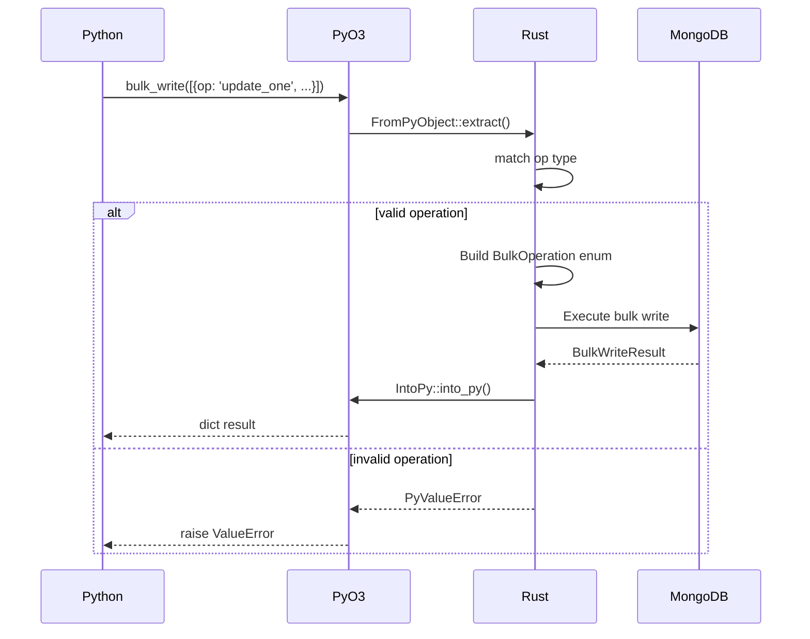

<spec>

# PyO3 FromPyObject 轉換實作

## Overview

實作 PyO3 FromPyObject trait 讓 Python dict 自動轉換為 Rust BulkOperation enum。這是 Python ↔ Rust 邊界的關鍵整合點，決定了 API 的易用性和效能。

## Requirements

### R1 - FromPyObject 實作

```yaml
id: R1
priority: high
status: draft
```

為 BulkOperation enum 實作 FromPyObject trait，支援從 Python dict 自動轉換

### R2 - 操作類型辨識

```yaml
id: R2
priority: high
status: draft
```

根據 dict 中的 'op' key 辨識操作類型 (update_one, insert_one, delete_one 等)

### R3 - 錯誤訊息

```yaml
id: R3
priority: medium
status: draft
```

提供清晰的錯誤訊息當轉換失敗時，包含缺少的欄位或無效的操作類型

### R4 - BSON Document 轉換

```yaml
id: R4
priority: high
status: draft
```

filter, update, document 欄位必須正確轉換為 bson::Document

### R5 - IntoPy 實作

```yaml
id: R5
priority: high
status: draft
```

為 BulkWriteResult 實作 IntoPy trait 讓結果可以返回 Python

## Acceptance Criteria

### Scenario: Python dict 轉 UpdateOne

- **GIVEN** Python dict {'op': 'update_one', 'filter': {...}, 'update': {...}}
- **WHEN** 傳入 Rust 函數
- **THEN** 自動轉換為 BulkOperation::UpdateOne

### Scenario: 缺少必要欄位

- **GIVEN** Python dict {'op': 'update_one'} 缺少 filter
- **WHEN** 傳入 Rust 函數
- **THEN** 拋出 PyValueError 包含 'missing field: filter'

### Scenario: 無效操作類型

- **GIVEN** Python dict {'op': 'unknown_op'}
- **WHEN** 傳入 Rust 函數
- **THEN** 拋出 PyValueError 包含 'unknown operation type'

### Scenario: 返回 BulkWriteResult

- **GIVEN** bulk_write 執行完成
- **WHEN** 結果返回 Python
- **THEN** Python 可以存取 result.inserted_count 等屬性

## Flow Diagram


```

</spec>
