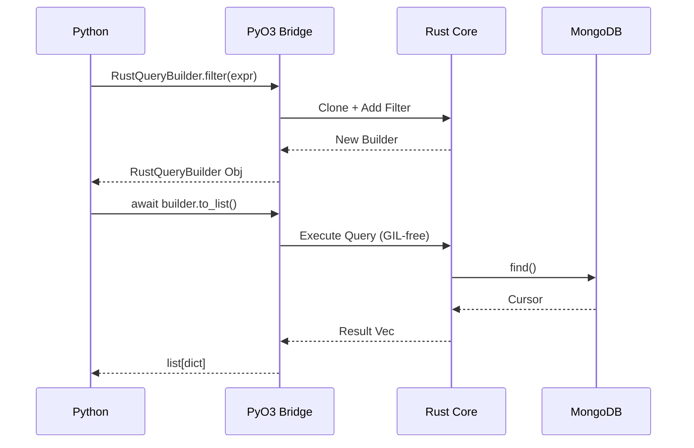

<spec>

# PyO3 QueryBuilder Bindings

## Overview

Implement PyO3 bindings to expose Rust QueryBuilder and QueryExpr logic to Python. This includes defining RustQueryBuilder and RustQueryExpr as PyO3 classes, supporting a chainable API, and providing an asynchronous to_list() method for query execution.



## Requirements

### R1 - RustQueryExpr PyO3 class

```yaml
id: R1
priority: high
status: draft
```

Implement a #[pyclass] RustQueryExpr providing static methods for common MongoDB operators: eq(), ne(), gt(), gte(), lt(), lte(), in_(), nin(), exists(), regex(), and_(), or_().

### R2 - RustQueryBuilder PyO3 class

```yaml
id: R2
priority: high
status: draft
```

Implement a #[pyclass] RustQueryBuilder providing filter(), sort(), skip(), limit(), and projection() methods, each returning a new instance for chaining.

### R3 - Async to_list implementation

```yaml
id: R3
priority: high
status: draft
```

Provide an asynchronous to_list() method on RustQueryBuilder that executes the MongoDB query and returns a list of dictionaries (PyDict) to Python.

### R4 - Async count implementation

```yaml
id: R4
priority: medium
status: draft
```

Provide an asynchronous count() method on RustQueryBuilder that returns the number of documents matching the current query state.

### R5 - Error Handling and Exception Mapping

```yaml
id: R5
priority: medium
status: draft
```

Map Rust-side errors (e.g., MongoDB errors, BSON conversion errors) to appropriate Python exceptions such as PyValueError or PyRuntimeError.

## Acceptance Criteria

### Scenario: QueryExpr Usage in Python

- **WHEN** The user calls RustQueryExpr.eq('name', 'Alice') from Python.
- **THEN** It returns a RustQueryExpr object that can be passed to the filter() method.

### Scenario: Fluent Chaining API in Python

- **WHEN** The user calls builder.filter(expr).sort([('name', 1)]).limit(10) from Python.
- **THEN** A new RustQueryBuilder object is returned with all the settings applied.

### Scenario: Asynchronous Query Execution

- **WHEN** The user awaits builder.to_list() from Python.
- **THEN** The MongoDB query is executed and a list of dictionaries is returned.

</spec>
