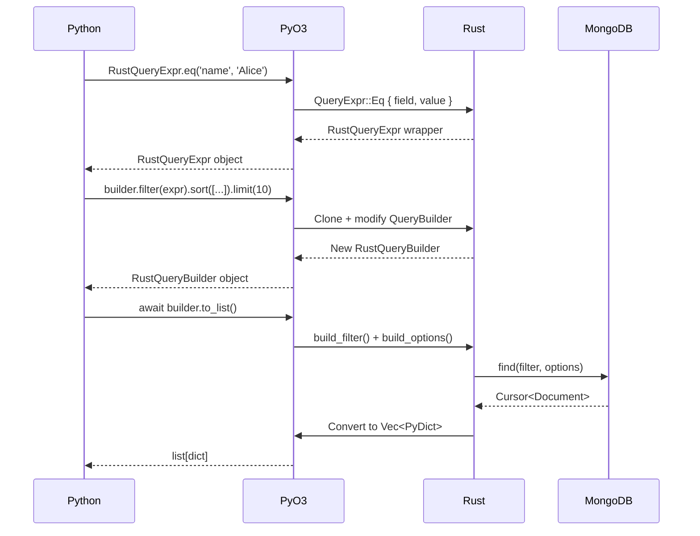

<spec>

# PyO3 QueryBuilder Bindings

## Overview

\u5be6\u4f5c PyO3 bindings \u5c07 Rust QueryBuilder \u548c QueryExpr \u66b4\u9732\u7d66 Python\u3002\u5305\u542b RustQueryBuilder \u548c RustQueryExpr PyO3 classes\uff0c\u652f\u63f4 chainable API \u548c async to_list() \u57f7\u884c\u3002

## Requirements

### R1 - RustQueryExpr PyO3 class

```yaml
id: R1
priority: high
status: draft
```

建立 #[pyclass] RustQueryExpr 提供靜態方法: eq(), ne(), gt(), gte(), lt(), lte(), in_(), nin(), exists(), regex(), and_(), or_()

### R2 - RustQueryBuilder PyO3 class

```yaml
id: R2
priority: high
status: draft
```

建立 #[pyclass] RustQueryBuilder 提供: new(), filter(), sort(), skip(), limit(), projection() 方法，每個方法回傳新的 RustQueryBuilder

### R3 - Async to_list

```yaml
id: R3
priority: high
status: draft
```

RustQueryBuilder 提供 async fn to_list() -> Vec<PyDict> 執行 MongoDB 查詢並回傳結果

### R4 - Async count

```yaml
id: R4
priority: medium
status: draft
```

RustQueryBuilder 提供 async fn count() -> u64 回傳符合條件的文件數量

### R5 - 錯誤處理

```yaml
id: R5
priority: medium
status: draft
```

將 Rust 錯誤轉換為 Python exceptions (PyValueError, PyRuntimeError)

## Acceptance Criteria

### Scenario: Python 使用 QueryExpr

- **GIVEN** Python 建立查詢條件
- **WHEN** 呼叫 RustQueryExpr.eq('name', 'Alice')
- **THEN** 回傳可用於 filter() 的 RustQueryExpr

### Scenario: Python chainable query

- **GIVEN** Python 建立查詢
- **WHEN** 呼叫 RustQueryBuilder('users').filter(expr).sort([('name', 1)]).limit(10)
- **THEN** 回傳新的 RustQueryBuilder 包含所有設定

### Scenario: Async to_list

- **GIVEN** QueryBuilder 已設定
- **WHEN** 呼叫 await builder.to_list()
- **THEN** 執行 MongoDB 查詢並回傳 list[dict]

## Flow Diagram


```

</spec>
