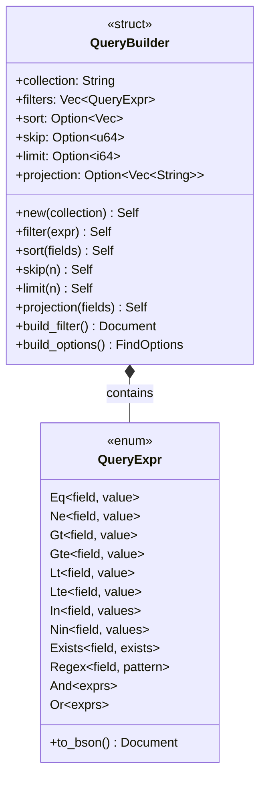

<spec>

# Rust QueryBuilder \u548c QueryExpr \u985e\u578b\u8a2d\u8a08

## Overview

\u5b9a\u7fa9 Rust \u7aef\u7684 QueryBuilder \u548c QueryExpr \u985e\u578b\u3002QueryBuilder \u63d0\u4f9b clone-based chainable API \u652f\u63f4 filter, sort, skip, limit, projection\u3002QueryExpr \u8868\u793a MongoDB \u67e5\u8a62\u689d\u4ef6\uff0c\u652f\u63f4 AND/OR \u904b\u7b97\u3002

## Requirements

### R1 - QueryExpr enum

```yaml
id: R1
priority: high
status: draft
```

定義 QueryExpr enum 包含: Eq, Ne, Gt, Gte, Lt, Lte, In, Nin, Exists, Regex, And, Or variants，每個 variant 包含 field name 和 value

### R2 - QueryBuilder struct

```yaml
id: R2
priority: high
status: draft
```

定義 QueryBuilder struct 包含: collection (String), filter (Vec<QueryExpr>), sort (Option<Vec<(String, i32)>>), skip (Option<u64>), limit (Option<i64>), projection (Option<Vec<String>>)

### R3 - Chainable methods

```yaml
id: R3
priority: high
status: draft
```

QueryBuilder 提供 filter(), sort(), skip(), limit(), projection() 方法，每個方法回傳 clone 的新 QueryBuilder

### R4 - Build methods

```yaml
id: R4
priority: high
status: draft
```

提供 build_filter() -> BsonDocument 和 build_options() -> FindOptions 方法將 QueryBuilder 轉換為 MongoDB 查詢

### R5 - QueryExpr to BSON

```yaml
id: R5
priority: high
status: draft
```

QueryExpr 提供 to_bson() 方法轉換為 MongoDB 查詢格式 (e.g., {"field": {"$eq": value}})

## Acceptance Criteria

### Scenario: Chain filter and sort

- **GIVEN** 需要查詢並排序
- **WHEN** 呼叫 QueryBuilder::new(coll).filter(expr).sort([("name", 1)]).build_filter()
- **THEN** 產生正確的 filter document 和 sort options

### Scenario: QueryExpr AND

- **GIVEN** 多個條件需要 AND
- **WHEN** 呼叫 QueryExpr::and(vec![eq, gt])
- **THEN** 產生 {"$and": [{...}, {...}]}

### Scenario: QueryExpr comparison

- **GIVEN** 單一比較條件
- **WHEN** 呼叫 QueryExpr::gt("age", 18).to_bson()
- **THEN** 產生 {"age": {"$gt": 18}}

## Flow Diagram


```

## API Specification (JSON Schema)

```yaml
$schema: https://json-schema.org/draft/2020-12/schema
description: MongoDB query expression
oneOf:
- properties:
    field:
      type: string
    op:
      enum:
      - $eq
      - $ne
      - $gt
      - $gte
      - $lt
      - $lte
    value: {}
  required:
  - field
  - op
  - value
  type: object
- properties:
    $and:
      items:
        $ref: '#'
      type: array
  required:
  - $and
  type: object
- properties:
    $or:
      items:
        $ref: '#'
      type: array
  required:
  - $or
  type: object
title: QueryExpr
```

</spec>
