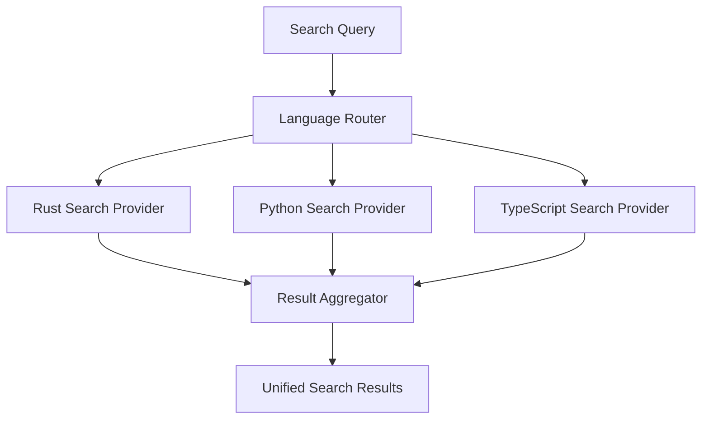

<spec>

# Unified Semantic Search API

## Overview

A language-agnostic semantic search API that provides consistent code discovery capabilities across Python, TypeScript, and Rust. It leverages the enhanced type systems of each language to provide accurate usage, caller, and type hierarchy information.

## Requirements

### R1 - Unified Search Operations

```yaml
id: R1
priority: high
status: draft
```

Define a common set of semantic search operations (Usages, Call Hierarchy, Type Hierarchy, Signature Match) applicable to all three languages.

### R2 - Cross-File Support

```yaml
id: R2
priority: high
status: draft
```

Enable searching for symbols and references across different files and languages within a project.

### R3 - Type-Aware Results

```yaml
id: R3
priority: high
status: draft
```

Provide accurate results by using the underlying type inference engines to resolve ambiguous identifiers.

### R4 - Performance and Scalability

```yaml
id: R4
priority: medium
status: draft
```

Optimize search performance using incremental indexing and efficient symbol lookup tables.

## Acceptance Criteria

### Scenario: Rust Call Hierarchy

- **GIVEN** A project with multiple Rust files.
- **WHEN** A 'Callers' search is requested for a specific function.
- **THEN** Prism should return a complete and accurate call tree for the symbol across the project.

### Scenario: Interface Implementation Search

- **GIVEN** A TypeScript project.
- **WHEN** Searching for implementations of a specific interface.
- **THEN** Prism should find all classes and object literals that satisfy the interface structure.

### Scenario: Unified Usage Search

- **GIVEN** A multi-language project.
- **WHEN** Searching for usages of a common symbol name.
- **THEN** Prism should return usages from all supported languages.

## Diagrams

### Unified Semantic Search Flow



</spec>
