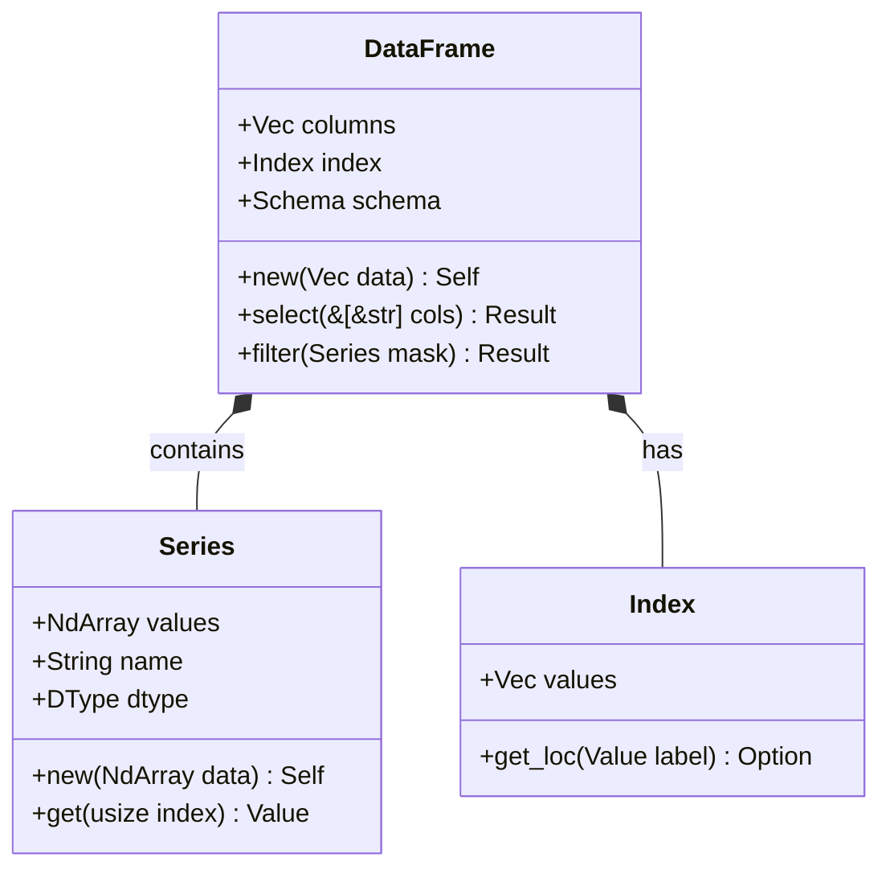

<spec>

# Pulsar Frame Core

## Overview

Defines the core structures and API for `cclab-pulsar-frame`, a pure Rust DataFrame library. It wraps `cclab-pulsar-array` for high-performance storage and integrates with `cclab-shield` for validation. Key components include `Series`, `DataFrame`, and `Index`.

## Requirements

### R1 - Series Structure

```yaml
id: R1
priority: medium
status: draft
```

The library must provide a `Series` struct that wraps `cclab-pulsar-array::NdArray`, supporting 1D data with a name and dtype.

### R2 - DataFrame Structure

```yaml
id: R2
priority: medium
status: draft
```

The library must provide a `DataFrame` struct that manages a collection of aligned `Series` and an `Index`.

### R3 - Indexing

```yaml
id: R3
priority: medium
status: draft
```

Users must be able to select data by integer position (`iloc`) and label (`loc`).

### R4 - IO Operations

```yaml
id: R4
priority: medium
status: draft
```

The library must support reading and writing CSV, JSON, and Parquet files.

### R5 - Aggregations and Joins

```yaml
id: R5
priority: medium
status: draft
```

The library must support GroupBy aggregations (sum, mean, count) and database-style joins (inner, left, outer).

### R6 - Shield Integration

```yaml
id: R6
priority: medium
status: draft
```

The library must allow validating DataFrame schema using `cclab-shield` definitions.

## Acceptance Criteria

### Scenario: Select Columns

- **GIVEN** A DataFrame with columns 'a' and 'b'
- **WHEN** I select column 'a'
- **THEN** A new DataFrame with only column 'a' is returned

### Scenario: Read CSV

- **GIVEN** A CSV file 'data.csv'
- **WHEN** I read the CSV file using `read_csv`
- **THEN** A DataFrame containing the CSV data is returned with correct types

### Scenario: Inner Join

- **GIVEN** Two DataFrames with a common key column
- **WHEN** I perform an inner join on the key column
- **THEN** A merged DataFrame with matching rows is returned

## Diagrams

### Pulsar Frame Class Diagram



</spec>
