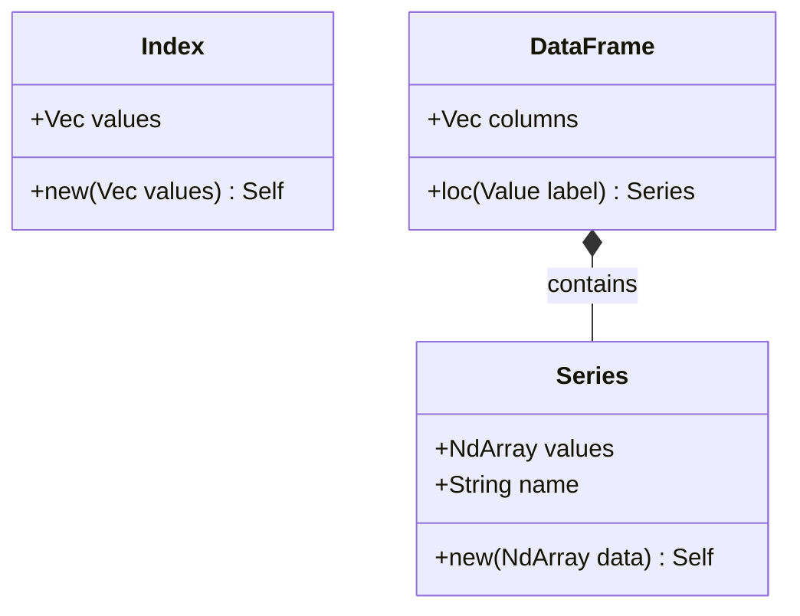

<spec>

# Pulsar Frame Core

## Overview

Defines the core structures (Series, DataFrame, Index) and indexing logic.

## Requirements

### R1 - Series Structure

```yaml
id: R1
priority: medium
status: draft
```

Implement Series struct.

### R2 - Index Structure

```yaml
id: R2
priority: medium
status: draft
```

Implement Index struct.

### R3 - DataFrame Structure

```yaml
id: R3
priority: medium
status: draft
```

Implement DataFrame struct.

### R4 - Indexing

```yaml
id: R4
priority: medium
status: draft
```

Implement loc/iloc indexing.

## Acceptance Criteria

### Scenario: Select Column

- **GIVEN** DataFrame
- **WHEN** Select col
- **THEN** Series returned

### Scenario: Loc Indexing

- **GIVEN** DataFrame
- **WHEN** Call loc
- **THEN** Row/Col returned

### Scenario: Iloc Indexing

- **GIVEN** DataFrame
- **WHEN** Call iloc
- **THEN** Row/Col returned

## Diagrams

### Core Classes



## Data Model

```json
{
  "properties": {
    "columns": {
      "items": {
        "$ref": "#/definitions/Series"
      },
      "type": "array"
    },
    "index": {
      "$ref": "#/definitions/Index"
    }
  },
  "required": [
    "columns",
    "index"
  ],
  "type": "object"
}
```

</spec>
