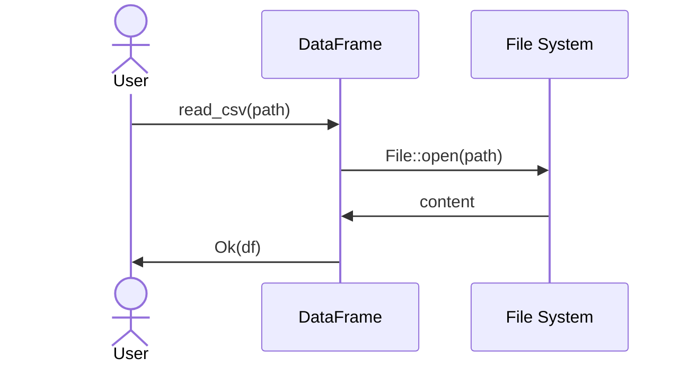

<spec>

# Pulsar Frame IO

## Overview

Defines IO operations for CSV, JSON, and Parquet formats. It includes traits and implementations for reading from and writing to these file formats, handling type conversion and error cases.

## Requirements

### R1 - CSV IO

```yaml
id: R1
priority: medium
status: draft
```

Implement CSV reader/writer.

### R2 - JSON IO

```yaml
id: R2
priority: medium
status: draft
```

Implement JSON reader/writer.

### R3 - Parquet IO

```yaml
id: R3
priority: medium
status: draft
```

Implement Parquet reader/writer.

## Acceptance Criteria

### Scenario: Read CSV

- **GIVEN** CSV file
- **WHEN** read_csv
- **THEN** DataFrame returned

### Scenario: Write JSON

- **GIVEN** DataFrame
- **WHEN** write_json
- **THEN** JSON file created

### Scenario: Read Parquet

- **GIVEN** Parquet file
- **WHEN** read_parquet
- **THEN** DataFrame returned

## Diagrams

### CSV Read Flow



</spec>
