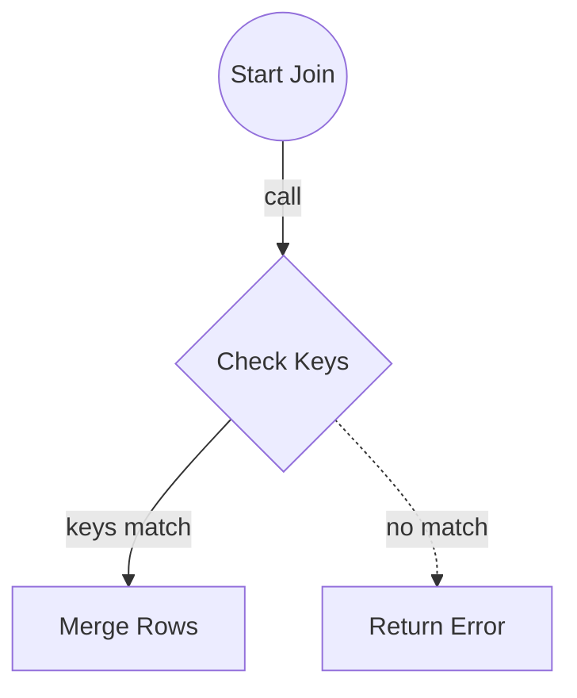

<spec>

# Pulsar Frame Ops

## Overview

Defines the GroupBy and Join operations for DataFrames. This includes aggregation functions (sum, mean, count) on grouped data and database-style joins (inner, left, outer) between two DataFrames.

## Requirements

### R1 - GroupBy

```yaml
id: R1
priority: medium
status: draft
```

Implement GroupBy aggregations.

### R2 - Join

```yaml
id: R2
priority: medium
status: draft
```

Implement Join operations.

## Acceptance Criteria

### Scenario: Sum Aggregation

- **GIVEN** Grouped DataFrame
- **WHEN** Call sum
- **THEN** Sum returned

### Scenario: Inner Join

- **GIVEN** Two DataFrames
- **WHEN** Call join
- **THEN** Joined DF returned

### Scenario: Left Join

- **GIVEN** Two DataFrames
- **WHEN** Call left_join
- **THEN** Left Joined DF returned

## Diagrams

### Join Logic



</spec>
