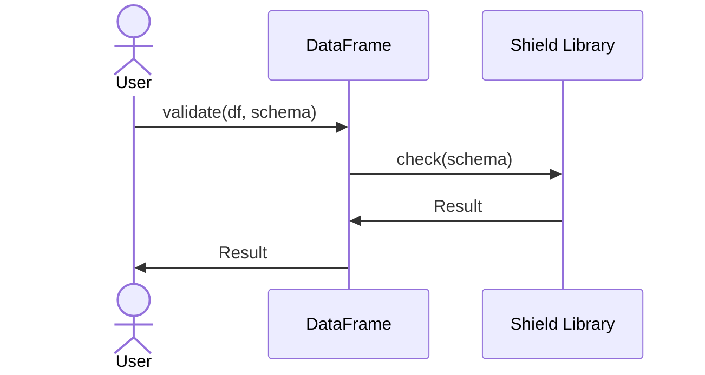

<spec>

# Pulsar Frame Shield

## Overview

Integrates `cclab-shield` to validate DataFrame schemas. This ensures that the data in the DataFrame matches the expected types and constraints defined in a Shield schema.

## Requirements

### R1 - Schema Validation

```yaml
id: R1
priority: medium
status: draft
```

Implement schema validation using cclab-shield.

## Acceptance Criteria

### Scenario: Validate Schema

- **GIVEN** DataFrame and Schema
- **WHEN** Call validate
- **THEN** Success or Error returned

## Diagrams

### Validation Flow



</spec>
