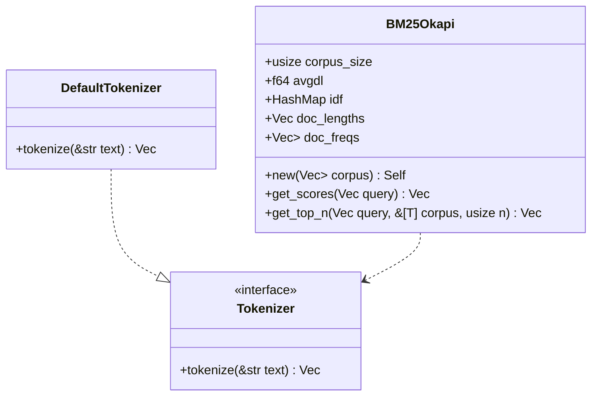

<spec>

# Pulsar BM25 Design

## Overview

This specification defines the design for the cclab-pulsar-bm25 crate, which implements the BM25Okapi ranking algorithm in pure Rust. It provides a flexible Tokenizer trait, batch indexing of document collections, and a scoring API compatible with the popular Python rank-bm25 library.

## Requirements

### R1 - Flexible Tokenizer Trait

```yaml
id: R1
priority: medium
status: draft
```

Define a Tokenizer trait to allow custom text processing strategies, with a default implementation for simple whitespace-based tokenization.

### R2 - BM25Okapi Scoring Engine

```yaml
id: R2
priority: high
status: draft
```

Implement the BM25Okapi scoring algorithm with configurable parameters (k1, b) and efficient IDF calculation.

### R3 - Corpus Statistics Indexing

```yaml
id: R3
priority: high
status: draft
```

Support batch indexing of a document corpus to pre-calculate Term Frequency (TF), Document Frequency (DF), and Average Document Length (avgdl).

### R4 - Top-K Result Retrieval

```yaml
id: R4
priority: medium
status: draft
```

Provide methods to retrieve top-K results for a given query, returning either the scores or the original document references.

### R5 - Rank-BM25 Compatible API

```yaml
id: R5
priority: medium
status: draft
```

Expose a user-friendly API that mirrors the rank-bm25 Python library, including get_scores and get_top_n methods.

## Acceptance Criteria

### Scenario: Score Query against Corpus

- **WHEN** A BM25Okapi instance is created with a tokenized corpus, and get_scores is called with a tokenized query.
- **THEN** The scores for each document should be returned as a Vec<f64>, where higher scores indicate better matches.

### Scenario: Retrieve Top N Documents

- **WHEN** get_top_n is called with a query and a list of documents.
- **THEN** The top N documents should be returned, sorted by their BM25 scores in descending order.

### Scenario: Custom Tokenizer Usage

- **WHEN** A user implements the Tokenizer trait and uses it to tokenize the corpus and queries.
- **THEN** The BM25 engine should use the custom tokenizer to process text if provided (via high-level wrapper or manually tokenized input).

## Diagrams

### Pulsar BM25 Class Diagram



</spec>
