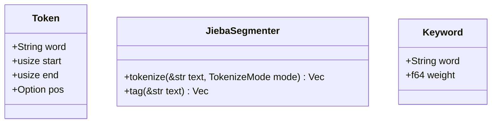

<spec>

# Pulsar Jieba Interfaces

## Overview

This specification defines the public interfaces and data structures for the `cclab-pulsar-jieba` library. It covers the core token structure and the functional interfaces for tokenization, keyword extraction, and POS tagging.

## Requirements

### R1 - Token Data Structure

```yaml
id: R1
priority: high
status: draft
```

A Token structure containing word, start/end offsets, and optional POS tag.

### R2 - Tokenization Interface

```yaml
id: R2
priority: high
status: draft
```

Function to tokenize text into a vector of Tokens based on the selected mode.

### R3 - Keyword Extraction Interface

```yaml
id: R3
priority: medium
status: draft
```

Function to extract keywords with associated TF-IDF scores.

### R4 - POS Tagging Interface

```yaml
id: R4
priority: medium
status: draft
```

Function to tag text and return Tokens with POS information.

## Acceptance Criteria

### Scenario: Tokenize with Offsets

- **WHEN** The text "我来到" is tokenized.
- **THEN** The first token should be "我" with start 0 and end 3.

### Scenario: Keyword Extraction with Weights

- **WHEN** Keyword extraction is run.
- **THEN** The result should be a vector of Keyword objects with weights.

## Diagrams

### Pulsar Jieba Class Diagram



## API Specification (JSON Schema)

```yaml
$schema: http://json-schema.org/draft-07/schema#
properties:
  end:
    description: End byte offset
    type: integer
  pos:
    description: Part of speech tag
    type: string
  start:
    description: Start byte offset
    type: integer
  word:
    description: The segmented word string
    type: string
required:
- word
- start
- end
type: object
```

</spec>
