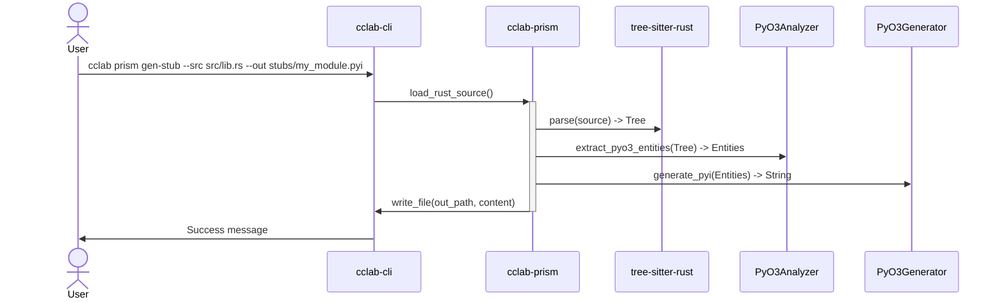

<spec>

# PyO3 Python Stub Generator

## Overview

This specification defines the PyO3 to Python stub (.pyi) generator. It covers the extraction of PyO3 entities from Rust source code using tree-sitter, the mapping of Rust types to Python type hints, and the generation of formatted .pyi files.

## Requirements

### R1 - Entity Extraction

```yaml
id: R1
priority: medium
status: draft
```

The system must extract entities annotated with #[pyclass], #[pyfunction], and methods within #[pymethods] blocks from Rust source code.

### R2 - Type Mapping

```yaml
id: R2
priority: medium
status: draft
```

The system must accurately map Rust types (primitives, containers, and custom pyclasses) to their corresponding Python type hints.

### R3 - Docstring Conversion

```yaml
id: R3
priority: medium
status: draft
```

The system must extract Rust documentation comments (/// or #[doc = "..."]) and convert them to Python docstrings.

### R4 - CLI Integration

```yaml
id: R4
priority: medium
status: draft
```

A new CLI command 'cclab prism gen-stub' must be provided to trigger generation.

### R5 - MCP Integration

```yaml
id: R5
priority: medium
status: draft
```

The functionality must be exposed as an MCP tool 'prism_generate_pyo3_stub'.

## Acceptance Criteria

### Scenario: Generate stub for simple pyclass and pyfunction

- **WHEN** The user runs 'cclab prism gen-stub' on a Rust file containing #[pyclass] struct MyClass and #[pyfunction] fn my_func(a: i32) -> String.
- **THEN** A .pyi file is generated containing 'class MyClass: ...' and 'def my_func(a: int) -> str: ...' with correct docstrings.

### Scenario: Handle complex types and Optionals

- **WHEN** The generator encounters fn process(items: Vec<i32>, name: Option<String>) -> PyResult<PyObject>.
- **THEN** The stub contains 'def process(items: list[int], name: Optional[str] = None) -> Any: ...'.

### Scenario: Extraction from multiple files in a directory

- **WHEN** The user runs 'cclab prism gen-stub' on a directory containing multiple .rs files.
- **THEN** Stubs are generated for all identified PyO3 entities across all Rust files in the directory.

## Diagrams

### PyO3 Stub Generation Flow



</spec>
