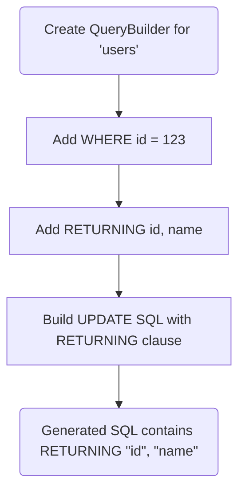

<spec>

# Builder Refinement: Fluent API and RETURNING Clause

## Overview

Refines the QueryBuilder fluent API in crates/cclab-titan/src/query/builder.rs and adds RETURNING clause support in crates/cclab-titan/src/query/modify.rs.

## Requirements

### R1 - Consistent Method Chaining

```yaml
id: R1
priority: high
status: draft
```

Ensure all QueryBuilder methods consistently use 'mut self -> Self' or 'mut self -> Result<Self>' to enable clean method chaining. Refactor select, where_clause, etc. if needed.

### R2 - RETURNING Clause Support

```yaml
id: R2
priority: medium
status: draft
```

Implement returning(*columns) in crates/cclab-titan/src/query/builder.rs to specify columns to return.

### R3 - RETURNING ALL Support

```yaml
id: R3
priority: medium
status: draft
```

Implement returning_all() in crates/cclab-titan/src/query/builder.rs as a shorthand for RETURNING *.

### R4 - Mutation SQL Integration

```yaml
id: R4
priority: high
status: draft
```

Update SQL generation in modify.rs (build_insert, build_update, build_delete) to include the RETURNING clause if specified.

## Acceptance Criteria

### Scenario: Update with RETURNING clause

- **GIVEN** A new QueryBuilder for 'users' table with a WHERE condition
- **WHEN** Calling .where_clause('id', Operator::Eq, 42).returning(&['id', 'name']).build_update(&[('name', 'Bob')])
- **THEN** Generated SQL should be UPDATE "users" SET "name" = $1 WHERE "id" = $2 RETURNING "id", "name"

### Scenario: Insert with RETURNING ALL clause

- **GIVEN** A new QueryBuilder for 'orders' table
- **WHEN** Calling .returning_all().build_insert(&[('total', 100)])
- **THEN** Generated SQL should be INSERT INTO "orders" ("total") VALUES ($1) RETURNING *

### Scenario: Method chaining with Results

- **GIVEN** A new QueryBuilder for 'products' table
- **WHEN** Calling QueryBuilder::new('products')?.select(vec!['id'.to_string()])?.where_clause('price', Operator::Gt, 10)?
- **THEN** Should allow chaining with ? operator and return the final configured builder

## Diagrams

### Update with RETURNING Flow



<semantic-data>

```json
{
  "edges": [],
  "metadata": null,
  "nodes": [
    {
      "id": "start_update",
      "semantic": {
        "type": "start"
      }
    },
    {
      "id": "where_id",
      "semantic": {
        "type": "assign"
      }
    },
    {
      "id": "returning_cols",
      "semantic": {
        "type": "assign"
      }
    },
    {
      "id": "build_update",
      "semantic": {
        "type": "transform"
      }
    },
    {
      "id": "end_update",
      "semantic": {
        "type": "return"
      }
    }
  ]
}
```

</semantic-data>

</spec>
