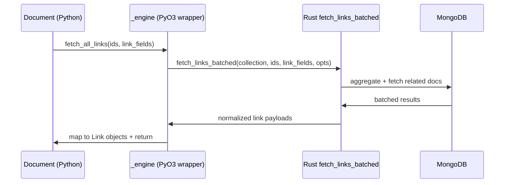

---
id: link-fetching
type: spec
title: "Rust Batched Link Fetching"
version: 1
spec_type: integration
spec_group: cclab-nebula
created_at: 2026-02-04T06:55:50.444243+00:00
updated_at: 2026-02-04T06:55:50.444243+00:00
requirements:
  total: 5
  ids:
    - R1
    - R2
    - R3
    - R4
    - R5
design_elements:
  has_mermaid: true
  has_json_schema: false
  has_pseudo_code: false
  has_api_spec: false
  has_semantic_diagrams: false
  diagrams:
    - type: sequence
      title: "Batched Link Fetch Flow"
history:
  - timestamp: 2026-02-04T06:55:50.444243+00:00
    agent: "mcp"
    tool: "create_spec"
    action: "created"
  - timestamp: 2026-02-04T06:55:57.436836+00:00
    agent: "codex:deep"
    tool: "revise_spec"
    action: "revised"
  - timestamp: 2026-02-04T06:56:12.699486+00:00
    agent: "codex:max"
    tool: "review_spec"
    action: "reviewed"---

<spec>

# Rust Batched Link Fetching

## Overview

将 forward link 的批量拉取迁移到 Rust，并由 PyO3 提供薄封装接口；Python 侧仅负责组装 LinkField 元数据与将结果回填为 Link 对象，BackLink 继续走现有 Python 路径。

## Requirements

### R1 - Rust Batched Fetch Interface

```yaml
id: R1
priority: must
status: draft
```

Rust 侧提供 `fetch_links_batched`（或等价命名）的 PyO3 暴露接口，接受 collection、文档 ids、LinkField 元数据与关联查询参数，并返回可用于重建 Link 的批量结果。

### R2 - Thin Python Wrapper

```yaml
id: R2
priority: must
status: draft
```

Python `_engine` 与 `QueryBuilder`/`Document.fetch_all_links` 仅做参数准备与调用，不再执行批量 link 查询逻辑；BackLink 仍使用现有 Python 路径。

### R3 - LinkField Metadata Build

```yaml
id: R3
priority: must
status: draft
```

Python 侧构建 `LinkField` 列表与目标 collection/type 解析逻辑保持现有语义，支持 list Link、可选 Link，并能在结果回填时保持字段顺序与字段命名一致。

### R4 - Result Mapping Parity

```yaml
id: R4
priority: should
status: draft
```

Rust 返回结果在 Python 侧回填为 `Link` 对象时，行为与现有实现一致，包括空值处理、缺失字段处理与错误信息格式。

### R5 - Test Coverage

```yaml
id: R5
priority: should
status: draft
```

补充或更新 `python/tests/mongo` 中的 link fetching 用例，覆盖单 link、list link、空字段、BackLink 路径与错误路径。

## Acceptance Criteria

### Scenario: Fetch Forward Links (Single)

- **GIVEN** 文档包含单一 forward Link 字段
- **WHEN** 调用 `Document.fetch_all_links`
- **THEN** Python 侧调用 Rust `fetch_links_batched` 并返回 Link 对象，字段值与旧实现一致。

### Scenario: Fetch Forward Links (List)

- **GIVEN** 文档包含 list Link 字段
- **WHEN** 调用 `Document.fetch_all_links`
- **THEN** 返回的每个字段是 Link 列表，顺序与旧实现一致。

### Scenario: Missing Or Empty Link Field

- **GIVEN** 文档缺少 Link 字段或字段为空
- **WHEN** 调用 `Document.fetch_all_links`
- **THEN** 对应字段返回空值/空列表，且不触发 Rust 端查询错误。

### Scenario: BackLink Uses Python Path

- **GIVEN** 文档包含 BackLink 字段
- **WHEN** 调用 `Document.fetch_all_links`
- **THEN** BackLink 仍通过现有 Python 路径查询并返回结果。

### Scenario: Invalid Target Collection

- **GIVEN** LinkField 指向无效 collection
- **WHEN** 调用 `Document.fetch_all_links`
- **THEN** 抛出与旧实现一致的异常类型与错误信息。

### Scenario: Result Mapping Parity For Missing Fields

- **GIVEN** LinkField 包含缺失字段与空值字段的组合
- **WHEN** 调用 `Document.fetch_all_links` 并回填结果
- **THEN** 返回的 Link 字段与旧实现一致，包括空值处理与缺失字段处理。

### Scenario: Link Fetch Tests Updated

- **GIVEN** `python/tests/mongo` 的 link fetching 测试集
- **WHEN** 执行测试套件
- **THEN** 覆盖单 link、list link、空字段、BackLink 路径与错误路径的 Rust 路径断言。

## Diagrams

### Batched Link Fetch Flow



</spec>
