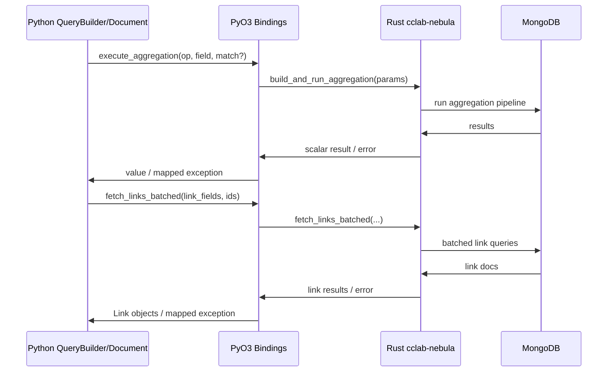

---
id: query-builder
type: spec
title: "Query Builder Rust Delegation"
version: 1
spec_type: integration
spec_group: nebula
created_at: 2026-02-04T07:00:08.986463+00:00
updated_at: 2026-02-04T07:00:08.986463+00:00
requirements:
  total: 6
  ids:
    - R1
    - R2
    - R3
    - R4
    - R5
    - R6
design_elements:
  has_mermaid: true
  has_json_schema: false
  has_pseudo_code: false
  has_api_spec: false
  has_semantic_diagrams: false
  diagrams:
    - type: sequence
      title: "QueryBuilder Delegation Flow"
history:
  - timestamp: 2026-02-04T07:00:08.986463+00:00
    agent: "mcp"
    tool: "create_spec"
    action: "created"
  - timestamp: 2026-02-04T07:00:15.277208+00:00
    agent: "codex:deep"
    tool: "revise_spec"
    action: "revised"
  - timestamp: 2026-02-04T07:00:32.970249+00:00
    agent: "codex:max"
    tool: "review_spec"
    action: "reviewed"---

<spec>

# Query Builder Rust Delegation

## Overview

Delegate QueryBuilder aggregation execution and forward-link resolution to Rust via PyO3, leaving Python as a thin wrapper that prepares parameters, builds LinkField metadata, and hydrates Link objects. This spec covers QueryBuilder/Document integration with the Rust aggregation helper and batched link fetching (see related specs `aggregation` and `link-fetching`).

## Requirements

### R1 - Aggregation Delegation

```yaml
id: R1
priority: high
status: draft
```

QueryBuilder aggregation helpers (avg/sum/min/max/count) must call the PyO3 aggregation entrypoint and must not construct MongoDB pipelines in Python. Python passes only operation, field, and optional match/filter parameters.

### R2 - Forward Link Fetch Delegation

```yaml
id: R2
priority: high
status: draft
```

Document.fetch_all_links and QueryBuilder link resolution must call the Rust batched link fetch helper via PyO3, removing Python-side batching/query logic for forward Link fields.

### R3 - LinkField Metadata Contract

```yaml
id: R3
priority: high
status: draft
```

Python must construct a LinkField metadata list that preserves field name, target collection, list semantics, and optionality for each forward Link field (including list Link). The mapping from collection name to target Python type must be resolved before invoking Rust so results can be hydrated correctly.

### R4 - BackLink Python Fallback

```yaml
id: R4
priority: medium
status: draft
```

BackLink fetching must continue to use the existing Python code path until Rust provides a BackLink implementation.

### R5 - Error Mapping Parity

```yaml
id: R5
priority: medium
status: draft
```

Errors from Rust aggregation and batched link fetch must surface to Python callers with the same exception types and compatible messages as the prior Python implementations.

### R6 - Regression Tests Updated

```yaml
id: R6
priority: medium
status: draft
```

Update python tests to cover QueryBuilder aggregations and Document link fetching on the Rust path, including list Link behavior, empty/missing links, and error parity.

## Acceptance Criteria

### Scenario: Aggregate Delegation Uses Rust

- **GIVEN** a QueryBuilder configured with an avg aggregation on a numeric field
- **WHEN** the aggregation is executed
- **THEN** Python calls the PyO3 aggregation helper and returns the Rust result without building the pipeline in Python.

### Scenario: Forward Link Fetch Uses Rust

- **GIVEN** a document with multiple forward Link fields and list Link fields
- **WHEN** Document.fetch_all_links is called
- **THEN** Python builds LinkField metadata and invokes Rust batched fetching, returning hydrated Link objects.

### Scenario: LinkField Metadata Preserves List Semantics

- **GIVEN** a forward Link field defined as a list with a target collection
- **WHEN** fetch_all_links executes
- **THEN** the LinkField metadata marks list semantics and resolves the correct target type for hydration.

### Scenario: BackLink Uses Python Path

- **GIVEN** a document with BackLink fields
- **WHEN** BackLink fetching is requested
- **THEN** the existing Python BackLink resolution path is used instead of Rust.

### Scenario: Error Mapping Preserved

- **GIVEN** Rust batched link fetch returns an error for an invalid field
- **WHEN** the error propagates to Python
- **THEN** the caller receives the same exception type and a compatible message as before.

### Scenario: Regression Tests Cover Rust Path

- **GIVEN** the python/tests/mongo suite
- **WHEN** tests are run for aggregations and link fetching
- **THEN** they cover avg/sum/min/max/count, list Link handling, empty/missing links, and error parity on the Rust path.

## Diagrams

### QueryBuilder Delegation Flow



</spec>
