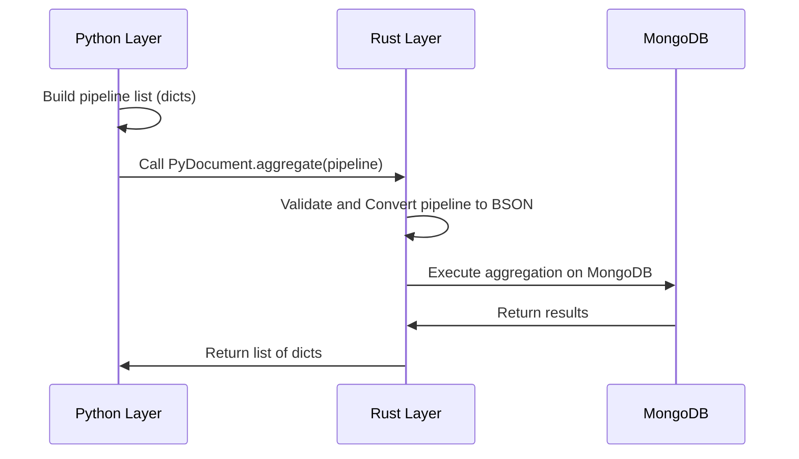

<spec>

# Nebula Aggregation Migration

## Overview

Ensure Python `AggregationBuilder` delegates execution to the Rust `PyDocument.aggregate` method, bypassing any legacy Python engine logic.

## Requirements

### R1 - Delegate Execution

```yaml
id: R1
priority: medium
status: draft
```

Python `AggregationBuilder.to_list` must call `PyDocument.aggregate` via the `_engine` bridge.

### R2 - Security Validation

```yaml
id: R2
priority: medium
status: draft
```

The Rust implementation must reject dangerous operators (like `$function`, `$accumulator`, `$where`) for security.

## Acceptance Criteria

### Scenario: Valid Aggregation

- **GIVEN** A valid aggregation pipeline built in Python
- **WHEN** User calls `User.aggregate(...).to_list()`
- **THEN** The pipeline is executed in Rust and results returned.

### Scenario: Unsafe Aggregation

- **GIVEN** A pipeline containing `$where` operator
- **WHEN** User attempts to execute the pipeline
- **THEN** A `ValueError` is raised by Rust validation.

## Diagrams

### Aggregation Execution Flow



</spec>
