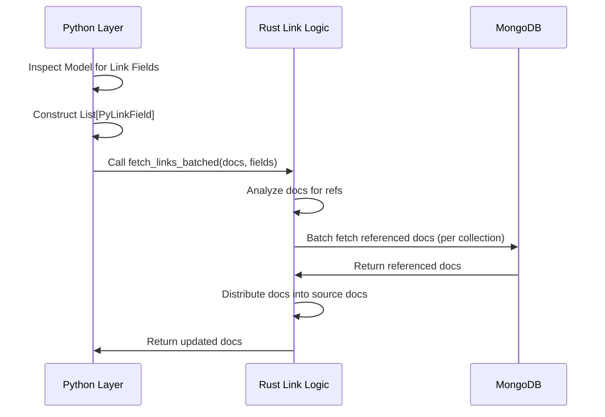

<spec>

# Nebula Link Fetching Migration

## Overview

Offload the complex batch link fetching logic to Rust. Python will provide the data and schema (LinkField definitions), and Rust will efficiently query and populate the links.

## Requirements

### R1 - Schema Extraction

```yaml
id: R1
priority: medium
status: draft
```

Python must extract `Link` and `BackLink` definitions from the model and convert them to `PyLinkField` objects.

### R2 - Replace Implementation

```yaml
id: R2
priority: medium
status: draft
```

Python `QueryBuilder` must replace `_batch_fetch_links_for_list` with a call to `cclab._nebula.fetch_links_batched`.

### R3 - Recursive Fetching

```yaml
id: R3
priority: medium
status: draft
```

The Rust implementation must recursively fetch links up to the specified depth.

## Acceptance Criteria

### Scenario: Fetch Links

- **GIVEN** A list of documents with unresolved `Link` fields
- **WHEN** User requests `fetch_links=True`
- **THEN** The Rust function populates the fields with the fetched document data.

### Scenario: Deep Fetch

- **GIVEN** A `fetch_links_depth` > 1
- **WHEN** User queries with depth
- **THEN** Rust recursively fetches nested links.

## Diagrams

### Batch Link Fetching Flow



</spec>
