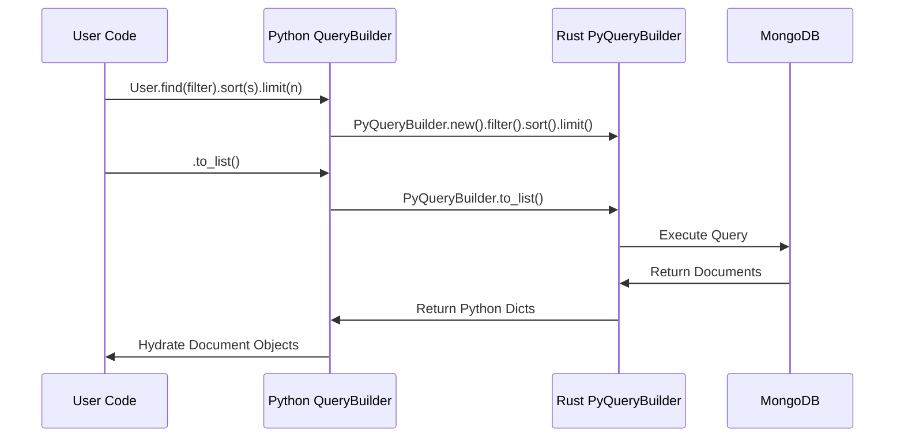

<spec>

# Nebula Query Builder Migration

## Overview

Refactor Python `QueryBuilder` to wrap the Rust `PyQueryBuilder`. This moves query construction and execution logic to Rust, while Python handles high-level object hydration.

## Requirements

### R1 - Wrap Rust Builder

```yaml
id: R1
priority: medium
status: draft
```

Python `QueryBuilder` must initialize and maintain a `PyQueryBuilder` instance.

### R2 - Delegate Construction

```yaml
id: R2
priority: medium
status: draft
```

Fluent methods (`filter`, `sort`, `skip`, `limit`, `project`) must delegate to the underlying `PyQueryBuilder`.

### R3 - Delegate Execution

```yaml
id: R3
priority: medium
status: draft
```

Execution methods (`to_list`, `count`, `first`) must call the corresponding `PyQueryBuilder` methods.

### R4 - Inheritance Handling

```yaml
id: R4
priority: medium
status: draft
```

Python side must still handle `_with_children` inheritance logic by adding appropriate filters before passing to Rust.

## Acceptance Criteria

### Scenario: Build and Execute

- **GIVEN** A `QueryBuilder` chain defined in Python
- **WHEN** User executes the query
- **THEN** The Rust builder is constructed incrementally and executed, returning raw dicts which Python hydrates.

### Scenario: Inheritance Query

- **GIVEN** A query on a child class in a polymorphic collection
- **WHEN** User queries the child model
- **THEN** Python adds the `_class_id` filter before delegating to Rust.

## Diagrams

### Query Builder Delegation Flow



</spec>
