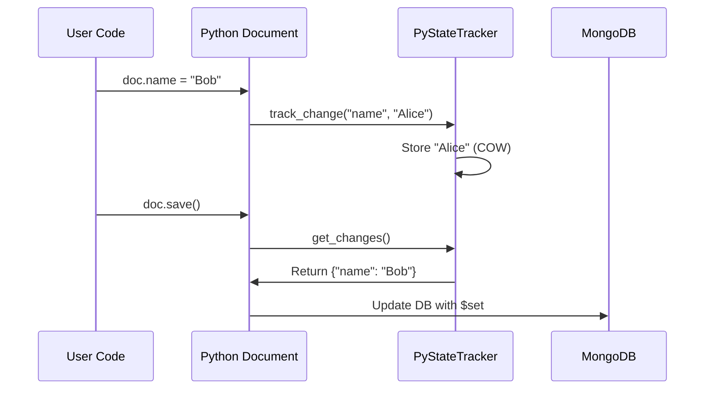

<spec>

# Nebula State Management Migration

## Overview

Replace the Python `StateTracker` with the Rust `PyStateTracker`. This reduces memory overhead for large documents and speeds up change detection.

## Requirements

### R1 - Tracker Integration

```yaml
id: R1
priority: medium
status: draft
```

Python `Document` class must initialize `PyStateTracker` in its constructor.

### R2 - Change Tracking

```yaml
id: R2
priority: medium
status: draft
```

Field modification in Python must trigger `tracker.track_change` on the Rust object.

### R3 - Optimized Save

```yaml
id: R3
priority: medium
status: draft
```

`Document.save()` must use `tracker.get_changes()` to optimize update payloads.

## Acceptance Criteria

### Scenario: Modify Field

- **GIVEN** A document with a `PyStateTracker`
- **WHEN** A field is modified
- **THEN** The change is tracked in Rust.

### Scenario: Save Changes

- **GIVEN** A tracked document
- **WHEN** `save()` is called
- **THEN** Only modified fields are sent to MongoDB.

## Diagrams

### State Tracking Flow



</spec>
