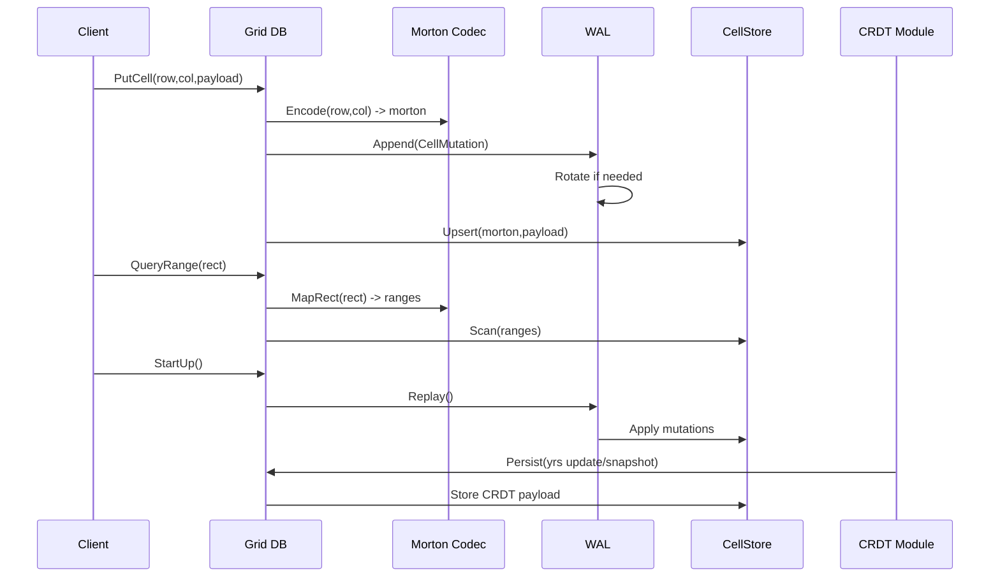

<spec>

# Grid DB Storage Architecture

## Overview

Defines the storage architecture for cclab-grid-db, including shared WAL integration, Morton-based cell addressing, range mapping, and CRDT payload handling using yrs updates/snapshots.

## Requirements

### R1 - Shared WAL crate

```yaml
id: R1
priority: high
status: draft
```

The system must provide a shared cclab-wal crate that exposes writer, reader, rotation, and recovery APIs usable by both cclab-grid-db and cclab-ion.

### R2 - Morton addressability

```yaml
id: R2
priority: high
status: draft
```

Cell coordinates must be encoded/decoded using Morton codes, and rectangular ranges must be mapped to one or more Morton ranges for efficient scans.

### R3 - CellStore durability

```yaml
id: R3
priority: high
status: draft
```

CellStore CRUD operations must be WAL-backed so that cell mutations are durable and can be rebuilt via WAL replay.

### R4 - CRDT payloads via yrs

```yaml
id: R4
priority: medium
status: draft
```

The CRDT module must persist yrs updates/snapshots as the stored payload format while preserving the module boundary for call sites.

### R5 - Ion WAL migration

```yaml
id: R5
priority: medium
status: draft
```

cclab-ion persistence must be refactored to consume the shared cclab-wal crate without changing its external behavior.

## Acceptance Criteria

### Scenario: Append cell update with WAL durability

- **GIVEN** A client submits a cell update (row, col, payload).
- **WHEN** Grid DB processes the update.
- **THEN** Grid DB encodes the coordinates with Morton, appends a WAL record, and upserts the CellStore entry in a durable order that supports recovery.

### Scenario: Range query over rectangle

- **GIVEN** A client requests a rectangular range query.
- **WHEN** Grid DB executes the range query.
- **THEN** Grid DB maps the rectangle to Morton ranges and scans CellStore to return matching cells.

### Scenario: Recovery on startup

- **GIVEN** Grid DB starts after an unclean shutdown.
- **WHEN** Recovery runs.
- **THEN** Grid DB replays WAL records to reconstruct CellStore state.

### Scenario: Persist CRDT snapshot

- **GIVEN** The CRDT module produces a yrs update or snapshot.
- **WHEN** The update is persisted to storage.
- **THEN** The stored payload is the yrs update/snapshot format and not the legacy LWW operation format.

### Scenario: Ion uses shared WAL crate

- **GIVEN** cclab-ion initializes its persistence layer.
- **WHEN** WAL writer/reader are constructed.
- **THEN** The implementation uses cclab-wal APIs while preserving existing persistence behavior.

## Diagrams

### Grid DB Storage Integration Flow



</spec>
