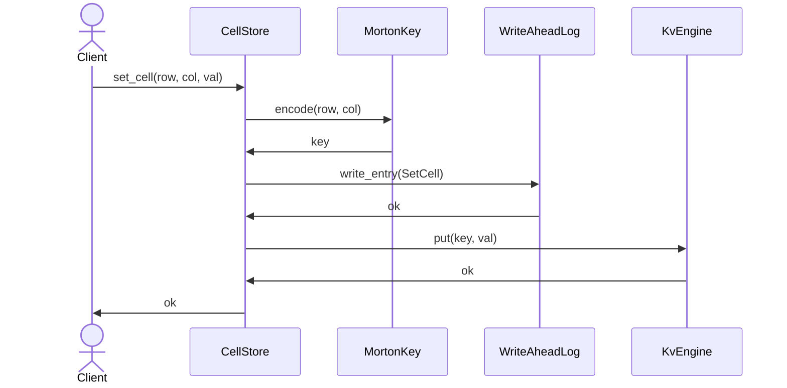

---
id: grid-db-architecture
type: spec
title: "Grid DB Architecture"
version: 1
spec_type: integration
spec_group: cclab-grid-db
created_at: 2026-02-05T04:38:28.459324+00:00
updated_at: 2026-02-05T04:38:28.459324+00:00
requirements:
  total: 4
  ids:
    - R1
    - R2
    - R3
    - R4
design_elements:
  has_mermaid: true
  has_json_schema: false
  has_pseudo_code: false
  has_api_spec: false
  has_semantic_diagrams: false
  diagrams:
    - type: class
      title: "Grid DB Class Structure"
    - type: sequence
      title: "Set Cell Flow"
history:
  - timestamp: 2026-02-05T04:38:28.459324+00:00
    agent: "mcp"
    tool: "create_spec"
    action: "created"
  - timestamp: 2026-02-05T04:43:56.868311+00:00
    agent: "codex:deep"
    tool: "create_spec"
    action: "created"
  - timestamp: 2026-02-05T04:44:16.451192+00:00
    agent: "codex:max"
    tool: "review_spec"
    action: "reviewed"
  - timestamp: 2026-02-05T04:45:57.302215+00:00
    agent: "codex:deep"
    tool: "revise_spec"
    action: "revised"
  - timestamp: 2026-02-05T04:46:13.786613+00:00
    agent: "codex:max"
    tool: "review_spec"
    action: "reviewed"---

<spec>

# Grid DB Architecture

## Overview

This specification defines the architecture of the `cclab-grid-db` persistent storage engine. It details the use of Morton encoding (Z-order curve) for mapping 2D spreadsheet coordinates to 1D keys suitable for Key-Value storage, ensuring spatial locality for efficient range queries. It also covers the `CellStore` service layer which orchestrates interactions between the encoding, the Write-Ahead Log (WAL) for durability/recovery, and the underlying `cclab-ion` KV engine.

## Requirements

### R1 - Morton Encoding

```yaml
id: R1
priority: high
status: draft
```

The system must support encoding 2D coordinates (row: u32, col: u32) into a unique 64-bit Morton key (Z-order curve) and decoding it back. This mapping must preserve spatial locality to optimize range queries.

### R2 - Cell Persistence

```yaml
id: R2
priority: high
status: draft
```

The system must provide a `CellStore` that allows persisting `CellValue`s identified by (row, col) coordinates. It must support retrieval of individual cells and deletion of cells.

### R3 - Range Queries

```yaml
id: R3
priority: high
status: draft
```

The system must support querying cells within a rectangular region (start_row, start_col, end_row, end_col). This must be implemented efficiently by calculating Morton key ranges and scanning the KV store.

### R4 - Durability (WAL)

```yaml
id: R4
priority: medium
status: draft
```

The system must persist operations to a Write-Ahead Log (WAL) before applying them to the KV store to ensure data durability and support crash recovery.

## Acceptance Criteria

### Scenario: Set and Get Cell

- **GIVEN** A `CellStore` initialized with an empty DB
- **WHEN** `set_cell(10, 20, "Hello")` is called
- **THEN** `get_cell(10, 20)` returns the stored value

### Scenario: Range Query

- **GIVEN** A `CellStore` with cells at (0,0), (0,1), (1,0), (1,1)
- **WHEN** `query_range(0, 0, 1, 1)` is called
- **THEN** It returns all 4 cells

### Scenario: Delete Cell

- **GIVEN** A `CellStore` with a cell at (5,5)
- **WHEN** `delete_cell(5, 5)` is called
- **THEN** `get_cell(5, 5)` returns None

## Diagrams

### Grid DB Class Structure

```mermaid
classDiagram
    class CellStore {
        <<service>>
        -Arc<KvEngine> kv_engine
        -WriteAheadLog wal
        -String sheet_id
        +new(AsRef<Path> path, String sheet_id) Result<Self>
        +get_cell(u32 row, u32 col) Result<Option<StoredCell>>
        +set_cell(u32 row, u32 col, CellValue value) Result<()>
        +query_range(u32 start_row, u32 start_col, u32 end_row, u32 end_col) Result<Vec<StoredCell>>
    }
    class MortonKey {
        <<service>>
        -u64 value
        +encode(u32 row, u32 col) Self
        +decode() (u32, u32)
        +range_for_rect(u32 start_row, u32 start_col, u32 end_row, u32 end_col) Vec<(MortonKey, MortonKey)>
    }
    class WriteAheadLog {
        <<service>>
        -PathBuf path
        -u64 sequence
        +write_entry(WalEntry entry) Result<u64>
        +replay(Fn callback) Result<()>
    }
    CellStore ..> MortonKey : uses
    CellStore *-- WriteAheadLog : uses
```

### Set Cell Flow



</spec>
