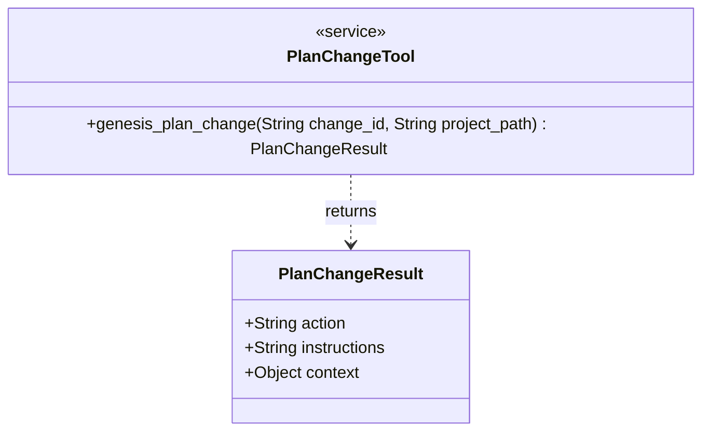
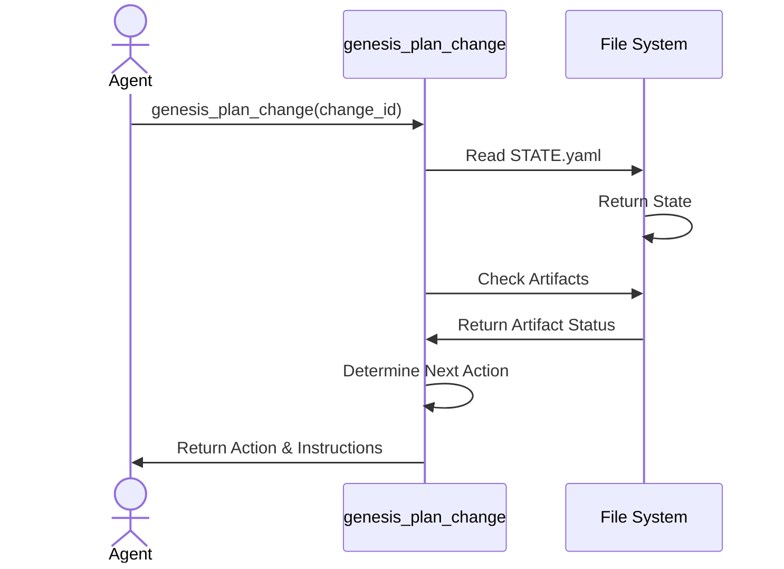

<spec>

# Plan Change MCP Tool

## Overview

This specification defines the `genesis_plan_change` MCP tool, which centralizes the orchestration logic for the planning phase of the Genesis workflow. Currently, this logic resides in the CLI and uses subprocesses. Moving it to an MCP tool allows for state-aware, atomic decision-making directly accessible to agents. The tool inspects the current state of a change (via `STATE.yaml` and file existence) and returns the next required action (e.g., `create_proposal`, `create_spec`) along with instructions. This enables a loop-based workflow where the agent calls this tool to know "what to do next".

## Requirements

### R1 - Input Parameters

```yaml
id: R1
priority: medium
status: draft
```

The tool must accept `change_id` and `project_path` as input parameters to locate the change directory.

### R2 - State Inspection

```yaml
id: R2
priority: medium
status: draft
```

The tool must read `STATE.yaml` in the change directory to understand the current recorded state. If the file is missing, it should assume an initial state.

### R3 - Artifact Verification

```yaml
id: R3
priority: medium
status: draft
```

The tool must verify the existence of key artifacts: `proposal.md`, `specs/` directory, `tasks.md`, and `CHALLENGE.md`.

### R4 - Action Determination

```yaml
id: R4
priority: medium
status: draft
```

Based on the state and artifacts, the tool must deterministically return one of the following actions: `create_proposal`, `create_spec`, `create_tasks`, `run_challenge`, `refine_proposal`, or `finish`.

### R5 - Instruction Output

```yaml
id: R5
priority: medium
status: draft
```

The tool must provide human-readable instructions explaining *why* the action was chosen and *what* the agent should do (e.g., "Proposal missing, please create it").

## Acceptance Criteria

### Scenario: New Change Start

- **GIVEN** A new change ID with no files
- **WHEN** genesis_plan_change is called
- **THEN** The tool returns action `create_proposal` with instructions to create the proposal.

### Scenario: Generate Specs

- **GIVEN** `proposal.md` exists but no specs
- **WHEN** genesis_plan_change is called
- **THEN** The tool returns action `create_spec` with instructions to generate specs from the proposal.

### Scenario: Generate Tasks

- **GIVEN** `proposal.md` and `specs/` exist but no tasks
- **WHEN** genesis_plan_change is called
- **THEN** The tool returns action `create_tasks` with instructions to generate tasks.

### Scenario: Run Challenge

- **GIVEN** All artifacts exist but `CHALLENGE.md` is missing
- **WHEN** genesis_plan_change is called
- **THEN** The tool returns action `run_challenge` to validate the plan.

### Scenario: Refine Proposal

- **GIVEN** `CHALLENGE.md` exists with `verdict: NEEDS_REVISION`
- **WHEN** genesis_plan_change is called
- **THEN** The tool returns action `refine_proposal` to address feedback.

### Scenario: Finish Planning

- **GIVEN** All artifacts exist and `CHALLENGE.md` has `verdict: APPROVED`
- **WHEN** genesis_plan_change is called
- **THEN** The tool returns action `finish` indicating the plan is complete and valid.

## Diagrams

### Plan Change Tool Structure



### Plan Change Orchestration Flow



## API Specification (OpenRPC 1.3)

```yaml
components:
  schemas:
    PlanChangeInput:
      properties:
        change_id:
          description: The ID of the change to plan
          type: string
        project_path:
          description: Root path of the project
          type: string
      required:
      - change_id
      - project_path
      type: object
    PlanChangeOutput:
      properties:
        action:
          description: The next action to perform
          enum:
          - create_proposal
          - create_spec
          - create_tasks
          - run_challenge
          - refine_proposal
          - finish
          type: string
        context:
          description: Additional context for the action
          type: object
        instructions:
          description: Human-readable instructions for the agent
          type: string
      required:
      - action
      - instructions
      type: object
info:
  title: Genesis Plan Change API
  version: 1.0.0
methods:
- name: genesis_plan_change
  params:
  - content:
      schema:
        $ref: '#/components/schemas/PlanChangeInput'
    name: input
    required: true
  result:
    content:
      schema:
        $ref: '#/components/schemas/PlanChangeOutput'
    name: output
openrpc: 1.3.0
```

</spec>
