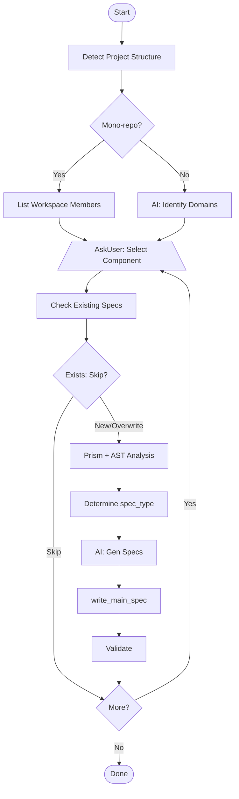
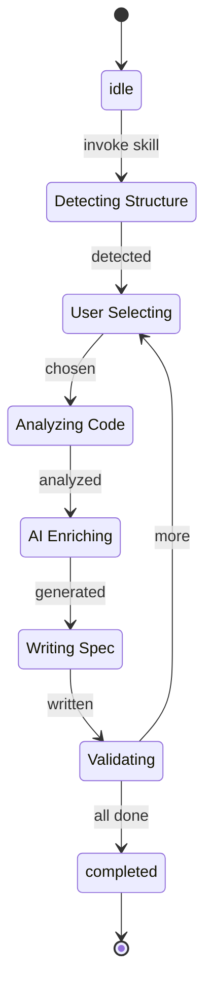

<spec>

# Fillback Main Specs Workflow Skill

## Overview

Defines the `/cclab:genesis:fillback-main-specs` skill — a standalone workflow that generates rich, Genesis-compatible specifications from existing code and writes them directly to `cclab/specs/{group}/`. The skill orchestrates existing MCP tools (analyze_code_for_spec, write_main_spec, Prism analysis, Aurora diagram generators) with AI enrichment to produce specs containing requirements, acceptance scenarios, Mermaid diagrams, and API specifications (OpenAPI, OpenRPC, AsyncAPI, JSON Schema). Supports two modes: mono-repo (process one workspace component at a time) and non-mono-repo (AI-assessed dynamic chunking by functional domain).

## Requirements

### R1 - Project Structure Detection

```yaml
id: R1
priority: high
status: draft
```

The skill must auto-detect whether the target project is a mono-repo (e.g., Cargo workspace with crates/, npm workspaces, Go modules) or a single-project repository. For mono-repos, identify all workspace members/components. For non-mono-repos, scan the top-level directory structure to assess project size and organization.

### R2 - Interactive Component Selection

```yaml
id: R2
priority: high
status: draft
```

After detection, present discovered components/domains to the user via AskUserQuestion. For mono-repos, list workspace members. For non-mono-repos, use AI (mainthread analysis) to identify functional domains, then let the user select which to process. Support processing one component at a time (mono-repo) or one domain at a time (non-mono-repo).

### R3 - Per-Component Code Analysis Pipeline

```yaml
id: R3
priority: high
status: draft
```

For each selected component: (1) Use prism_symbols to extract all symbols, (2) Use analyze_code_for_spec to get spec structure recommendations, (3) Determine spec_type based on code patterns (http-api, rpc-api, event-driven, data-model, algorithm, utility). Group related files into logical specs (e.g., one spec per major module or API surface).

### R4 - Rich Spec Generation with AI Enrichment

```yaml
id: R4
priority: high
status: draft
```

For each identified spec unit, the mainthread LLM must read the actual source code and generate: (1) Overview describing the module purpose and architecture, (2) Requirements (R1, R2, ...) extracted from code behavior, (3) Acceptance scenarios in Given/When/Then format, (4) Mermaid diagrams appropriate to spec_type using Aurora tools (class diagram for data models, sequence for API flows, flowchart for algorithms, state diagram for state machines, ERD for database models), (5) API specifications where applicable (OpenAPI for HTTP endpoints, OpenRPC for RPC methods, AsyncAPI for event handlers, JSON Schema for data models).

### R5 - Direct Write to Main Specs

```yaml
id: R5
priority: high
status: draft
```

Write generated specs directly to cclab/specs/{spec_group}/ using genesis_write_main_spec MCP tool. The spec_group should match the component name (e.g., cclab-orbit, cclab-titan). Skip the change workflow (no proposal/review cycle) since this records existing behavior.

### R6 - Existing Spec Detection and Skip

```yaml
id: R6
priority: medium
status: draft
```

Before generating a spec, check if a main spec with the same ID already exists in cclab/specs/{group}/. If it exists, inform the user and skip by default. Allow user to choose to overwrite via AskUserQuestion.

### R7 - Dynamic Chunking for Large Codebases

```yaml
id: R7
priority: medium
status: draft
```

For non-mono-repo projects with many files (>100), apply intelligent chunking: (1) Group files by directory structure, (2) Use import/dependency analysis to identify cohesive modules, (3) Present chunk boundaries to user for confirmation, (4) Process one chunk at a time to stay within context limits.

### R8 - Skill Registration and Distribution

```yaml
id: R8
priority: high
status: draft
```

Create the skill SKILL.md in both .claude/skills/ (for current project) and crates/cclab-genesis/templates/mainthread/skills/ (for cclab init distribution). Register the skill in CLAUDE.md workflow table under a new 'Utility Skills' or 'Fillback' section.

## Acceptance Criteria

### Scenario: Fillback mono-repo component

- **GIVEN** A Cargo workspace with crates/cclab-orbit/ containing Rust source files
- **WHEN** User runs /cclab:genesis:fillback-main-specs and selects cclab-orbit
- **THEN** Skill analyzes cclab-orbit source, generates rich specs with Mermaid diagrams and requirements, writes to cclab/specs/cclab-orbit/

### Scenario: Fillback non-mono-repo with chunking

- **GIVEN** A Python project with 200+ files across src/api/, src/models/, src/services/
- **WHEN** User runs /cclab:genesis:fillback-main-specs
- **THEN** Skill identifies 3 functional domains (api, models, services), user selects one, generates specs for that domain

### Scenario: Skip existing specs

- **GIVEN** cclab/specs/cclab-orbit/architecture.md already exists
- **WHEN** Fillback attempts to generate architecture spec for cclab-orbit
- **THEN** Skill detects existing spec, informs user, skips unless user chooses to overwrite

### Scenario: Generate HTTP API spec

- **GIVEN** Source code contains HTTP endpoint handlers with routes and request/response types
- **WHEN** Spec generation runs for an HTTP API module
- **THEN** Generated spec includes spec_type=http-api, OpenAPI 3.1 specification, and sequence diagram showing request flow

### Scenario: Generate data model spec

- **GIVEN** Source code contains struct/class definitions with database annotations
- **WHEN** Spec generation runs for a data model module
- **THEN** Generated spec includes spec_type=data-model, JSON Schema for the models, ERD diagram, and class diagram

### Scenario: Handle large component with sub-chunking

- **GIVEN** A component has 80+ source files exceeding single-pass context limits
- **WHEN** Fillback processes this component
- **THEN** Skill sub-chunks by module groups (based on imports), generates multiple specs per component, each within context limits

## Diagrams

### Fillback Main Specs Pipeline



### Fillback Skill States



</spec>
