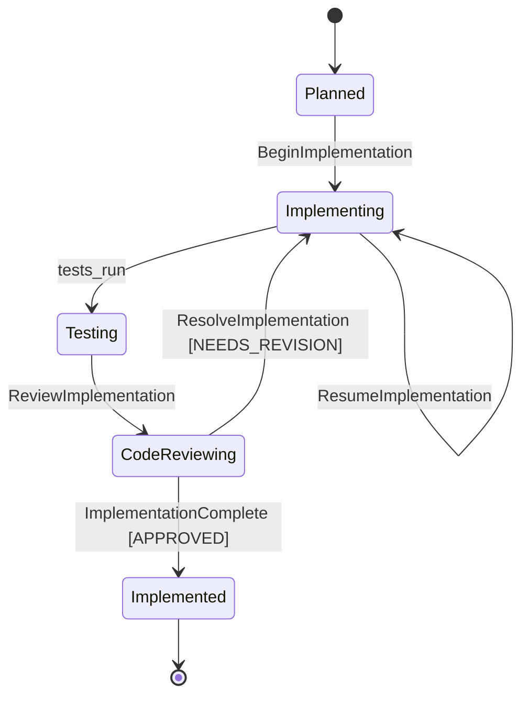

<spec>

# genesis_impl_change MCP Workflow Tool

## Overview

The genesis_impl_change MCP tool orchestrates the implementation workflow by analyzing the current state and returning the next action for the mainthread to execute. It manages transitions through StatePhase: Planned → Implementing → Testing → CodeReviewing → Implemented. The tool reads STATE.yaml to determine current phase, checks for REVIEW_IMPL.md verdicts, and returns structured JSON with action type and instructions.

## Requirements

### R1 - ImplAction Enum

```yaml
id: R1
priority: high
status: draft
```

Define ImplAction enum with variants: BeginImplementation (entry from Planned), ResumeImplementation (continue partial work), ReviewImplementation (trigger code review), ResolveImplementation (fix review issues), ImplementationComplete (APPROVED verdict), AlreadyImplemented (already at Implemented), NotReady (not at Planned yet)

### R2 - State Analysis

```yaml
id: R2
priority: high
status: draft
```

Analyze current state from STATE.yaml phase, check existence of REVIEW_IMPL.md, extract verdict (APPROVED/NEEDS_REVISION/REJECTED) to determine next action

### R3 - Tool Definition

```yaml
id: R3
priority: high
status: draft
```

Provide MCP tool definition with input schema requiring project_path and change_id parameters, following existing tool patterns

### R4 - Security Validation

```yaml
id: R4
priority: high
status: draft
```

Validate change_id format (lowercase alphanumeric with hyphens only) to prevent directory traversal attacks

### R5 - Response Format

```yaml
id: R5
priority: medium
status: draft
```

Return JSON response with fields: action (string), phase (current phase), instructions (detailed steps), metadata (context-specific data like review_verdict)

### R6 - Agent Config Integration

```yaml
id: R6
priority: medium
status: draft
```

Use new AgentsConfig API with WorkflowArtifact::Implement and WorkflowArtifact::ReviewImpl for agent configuration lookup

## Acceptance Criteria

### Scenario: Start implementation from Planned

- **GIVEN** Change is at Planned phase with approved specs
- **WHEN** genesis_impl_change is called
- **THEN** Returns BeginImplementation action with instructions to read specs and implement requirements

### Scenario: Resume partial implementation

- **GIVEN** Change is at Implementing phase
- **WHEN** genesis_impl_change is called
- **THEN** Returns ResumeImplementation action with progress context

### Scenario: Trigger code review

- **GIVEN** Change is at Testing phase (tests passing)
- **WHEN** genesis_impl_change is called
- **THEN** Returns ReviewImplementation action to create REVIEW_IMPL.md

### Scenario: Fix review issues

- **GIVEN** Change is at CodeReviewing with NEEDS_REVISION verdict
- **WHEN** genesis_impl_change is called
- **THEN** Returns ResolveImplementation action with issue list from review

### Scenario: Complete implementation

- **GIVEN** Change is at CodeReviewing with APPROVED verdict
- **WHEN** genesis_impl_change is called
- **THEN** Returns ImplementationComplete action, phase transitions to Implemented

### Scenario: Not ready for implementation

- **GIVEN** Change is at ProposalApproved phase (not yet Planned)
- **WHEN** genesis_impl_change is called
- **THEN** Returns NotReady action with message to complete planning first

## Diagrams

### Implementation Workflow State Machine



</spec>
