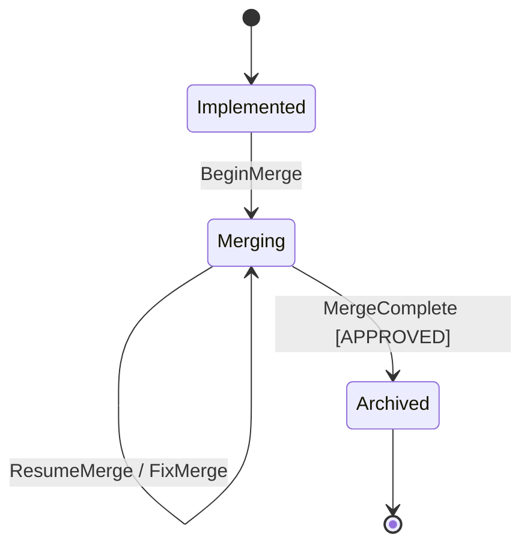

<spec>

# genesis_merge_change MCP Workflow Tool

## Overview

The genesis_merge_change MCP tool orchestrates the merge workflow by analyzing the current state and returning the next action for the mainthread to execute. It manages transitions through StatePhase: Implemented → Merging → Archived. The tool reads STATE.yaml to determine current phase, checks for REVIEW_MERGE.md verdicts, and automatically archives the change after review passes. This completes the Genesis SDD workflow cycle.

## Requirements

### R1 - MergeAction Enum

```yaml
id: R1
priority: high
status: draft
```

Define MergeAction enum with variants: BeginMerge (entry from Implemented), ResumeMerge (continue partial merge), ReviewMerge (trigger merge quality review), FixMerge (fix review issues), MergeComplete (APPROVED verdict → archive), AlreadyArchived (already at Archived), NotReady (not at Implemented yet)

### R2 - State Analysis

```yaml
id: R2
priority: high
status: draft
```

Analyze current state from STATE.yaml phase, check existence of REVIEW_MERGE.md, extract verdict (APPROVED/NEEDS_REVISION/REJECTED) to determine next action

### R3 - Tool Definition

```yaml
id: R3
priority: high
status: draft
```

Provide MCP tool definition with input schema requiring project_path and change_id parameters, following existing tool patterns

### R4 - Security Validation

```yaml
id: R4
priority: high
status: draft
```

Validate change_id format (lowercase alphanumeric with hyphens only) to prevent directory traversal attacks

### R5 - Response Format

```yaml
id: R5
priority: medium
status: draft
```

Return JSON response with fields: action (string), phase (current phase), instructions (detailed steps), metadata (context-specific data like specs_to_merge, archive_path)

### R6 - Auto Archive

```yaml
id: R6
priority: high
status: draft
```

When REVIEW_MERGE verdict is APPROVED, return MergeComplete action that instructs mainthread to move change to genesis/archive/{date}-{change_id}/

### R7 - Agent Config Integration

```yaml
id: R7
priority: medium
status: draft
```

Use new AgentsConfig API with WorkflowArtifact::MergeSpecs and WorkflowArtifact::ReviewMerge for agent configuration lookup

## Acceptance Criteria

### Scenario: Start merge from Implemented

- **GIVEN** Change is at Implemented phase with passing review
- **WHEN** genesis_merge_change is called
- **THEN** Returns BeginMerge action with list of specs to merge into cclab/specs/

### Scenario: Resume partial merge

- **GIVEN** Change is at Merging phase with some specs merged
- **WHEN** genesis_merge_change is called
- **THEN** Returns ResumeMerge action with remaining specs list

### Scenario: Trigger merge review

- **GIVEN** Change is at Merging phase with all specs merged
- **WHEN** genesis_merge_change is called
- **THEN** Returns ReviewMerge action to create REVIEW_MERGE.md

### Scenario: Fix merge issues

- **GIVEN** REVIEW_MERGE.md has NEEDS_REVISION verdict
- **WHEN** genesis_merge_change is called
- **THEN** Returns FixMerge action with issue list from review

### Scenario: Complete and archive

- **GIVEN** REVIEW_MERGE.md has APPROVED verdict
- **WHEN** genesis_merge_change is called
- **THEN** Returns MergeComplete action with archive_path for moving change to genesis/archive/

### Scenario: Not ready for merge

- **GIVEN** Change is at CodeReviewing phase (not yet Implemented)
- **WHEN** genesis_merge_change is called
- **THEN** Returns NotReady action with message to complete implementation first

## Diagrams

### Merge Workflow State Machine



</spec>
