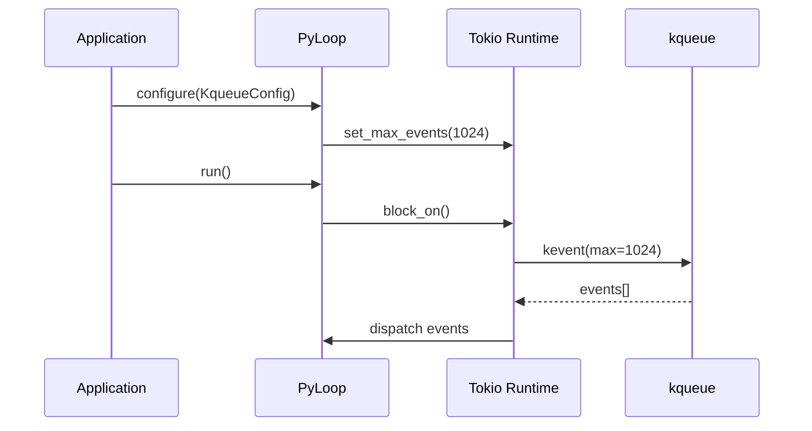

<spec>

# kqueue Optimization for macOS/BSD

## Overview

Add kqueue-specific tuning options for macOS and BSD systems. While Tokio already uses kqueue internally, this spec enables advanced users to configure kqueue-specific behaviors like EV_CLEAR semantics, batch event collection size, and optional direct mio access for specialized use cases.

## Requirements

### R1 - kqueue configuration struct

```yaml
id: R1
priority: high
status: draft
```

Create KqueueConfig struct with tunable parameters: max_events (batch size), edge_triggered mode preference

### R2 - Conditional compilation

```yaml
id: R2
priority: high
status: draft
```

All kqueue-specific code gated behind #[cfg(any(target_os = "macos", target_os = "freebsd", ...))] and kqueue-tuning feature

### R3 - PyLoop integration

```yaml
id: R3
priority: medium
status: draft
```

Expose kqueue configuration through PyLoop constructor or configuration method

### R4 - Documentation

```yaml
id: R4
priority: medium
status: draft
```

Document kqueue tuning options and when they're beneficial (high-connection servers, latency-sensitive apps)

## Acceptance Criteria

### Scenario: Default kqueue behavior

- **GIVEN** macOS system without kqueue-tuning feature
- **WHEN** Create PyLoop
- **THEN** Uses Tokio's default kqueue settings

### Scenario: Custom batch size

- **GIVEN** kqueue-tuning feature enabled
- **WHEN** Create PyLoop with max_events=1024
- **THEN** kqueue collects up to 1024 events per kevent() call

### Scenario: Non-BSD platform

- **WHEN** Build on Linux with kqueue-tuning feature
- **THEN** Feature compiles but kqueue code is not included

## Flow Diagram



</spec>
