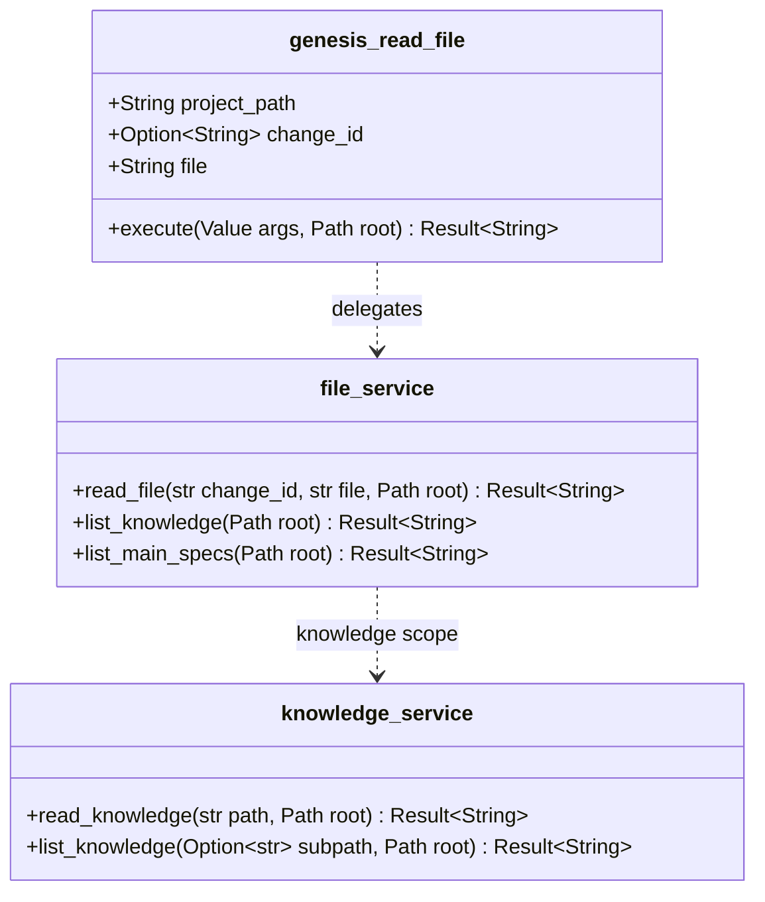

<spec>

# Consolidated genesis_read_file MCP Tool

## Overview

Extends the existing genesis_read_file MCP tool to handle all file-reading operations across three scopes: change artifacts (existing), knowledge base (new), and main specs (new). The file parameter gains scope prefix syntax to route requests. Six standalone tools are removed and their logic absorbed into the unified read_file dispatch. This reduces MCP tool count by 6, saving ~1500 tokens per agent invocation.

## Requirements

### R1 - Scope prefix syntax for file parameter

```yaml
id: R1
priority: high
status: draft
```

The file parameter accepts scope prefixes: 'knowledge:path' reads from cclab/knowledge/, 'main_spec:group/id' reads from cclab/specs/group/id.md, 'list:knowledge' lists knowledge docs, 'list:main_specs' lists main specs, 'list:specs' lists change specs, 'requirements' reads all requirements. Unprefixed values retain existing behavior.

### R2 - Remove 6 standalone tool registrations

```yaml
id: R2
priority: high
status: draft
```

Remove genesis_read_knowledge, genesis_list_knowledge, genesis_read_main_spec, genesis_list_main_specs, genesis_read_all_requirements, genesis_list_specs from ToolRegistry.

### R3 - Update tool definition schema

```yaml
id: R3
priority: high
status: draft
```

Update genesis_read_file JSON schema. change_id becomes optional.

### R4 - Update run_change prompt strings

```yaml
id: R4
priority: high
status: draft
```

Update all run_change prompt strings referencing removed tool names.

### R5 - Path traversal prevention

```yaml
id: R5
priority: high
status: draft
```

Prevent directory traversal for knowledge: and main_spec: scopes.

### R6 - Preserve existing service logic

```yaml
id: R6
priority: medium
status: draft
```

Reuse knowledge_service.rs and main_spec logic without duplication.

## Acceptance Criteria

### Scenario: Read knowledge via prefix

- **GIVEN** Knowledge doc exists
- **WHEN** genesis_read_file(file='knowledge:40-mcp/index.md')
- **THEN** Returns knowledge doc content

### Scenario: List knowledge via prefix

- **WHEN** genesis_read_file(file='list:knowledge')
- **THEN** Returns formatted listing

### Scenario: Read main spec via prefix

- **GIVEN** Main spec exists
- **WHEN** genesis_read_file(file='main_spec:cclab-genesis/run-change')
- **THEN** Returns main spec content

### Scenario: List main specs via prefix

- **WHEN** genesis_read_file(file='list:main_specs')
- **THEN** Returns listing by group

### Scenario: Read all requirements

- **GIVEN** Change has proposal+tasks+specs
- **WHEN** genesis_read_file(change_id='x', file='requirements')
- **THEN** Returns combined content

### Scenario: Backward compatible

- **WHEN** genesis_read_file(change_id='x', file='proposal')
- **THEN** Returns proposal unchanged

### Scenario: Path traversal blocked

- **WHEN** genesis_read_file(file='knowledge:../../etc/passwd')
- **THEN** Error returned

### Scenario: Removed tools gone

- **WHEN** Client lists MCP tools
- **THEN** 6 removed tools not listed

## Diagrams

### Consolidated read_file Dispatch Architecture



## API Specification (OpenRPC 1.3)

```yaml
info:
  title: Genesis Read File Consolidated
  version: 2.0.0
methods:
- name: genesis_read_file
  params:
  - name: project_path
    required: true
    schema:
      type: string
  - name: change_id
    required: false
    schema:
      type: string
  - name: file
    required: false
    schema:
      default: proposal
      type: string
  result:
    name: content
    schema:
      type: string
  summary: Read any genesis file with scope prefix routing
openrpc: 1.3.2
```

</spec>
