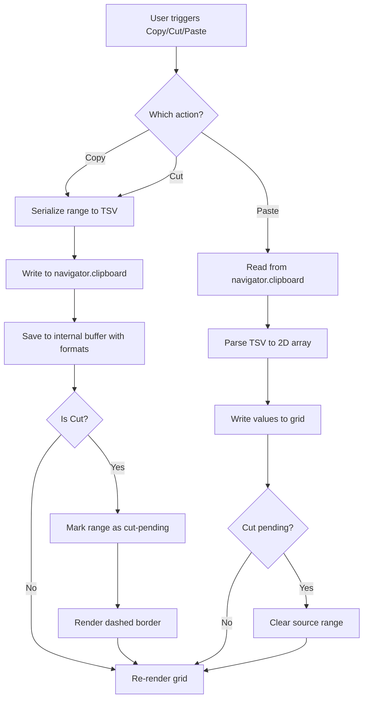

<spec>

# Context Menu Clipboard Operations

## Overview

Define clipboard operations (Cut, Copy, Paste, Paste Special) for the grid context menu. Covers cell range serialization to TSV format for system clipboard, reading TSV from clipboard on paste, handling single-cell and multi-cell ranges, cut-mode visual indicator (dashed border), paste with formula reference adjustment, and Paste Special options (values only, formatting only). Uses the navigator.clipboard async API with fallback to document.execCommand for older browsers.

## Requirements

### R1 - Copy selected range to clipboard

```yaml
id: R1
priority: high
status: draft
```

When Copy is triggered (context menu or Ctrl+C), serialize the selected cell range to TSV (tab-separated values) format and write to the system clipboard via navigator.clipboard.writeText(). Each row is separated by newline, each cell by tab. Formula cells copy their display value, not the formula string. Empty cells produce empty strings between tabs.

### R2 - Cut selected range

```yaml
id: R2
priority: high
status: draft
```

Cut works like Copy but additionally marks the source range as 'cut pending'. A dashed border animation is rendered around the cut range (similar to Google Sheets marching ants). On paste, the source range is cleared. If the user performs any other action (typing, selecting new cell without pasting), the cut state is cancelled and the dashed border removed.

### R3 - Paste from clipboard

```yaml
id: R3
priority: high
status: draft
```

When Paste is triggered (context menu or Ctrl+V), read TSV text from navigator.clipboard.readText(), parse into a 2D array of strings, and write to the grid starting at the active cell position. Each parsed value is set via rusheet.setCellValue(). If the paste area is larger than the clipboard data, only the clipboard data area is written. If clipboard data extends beyond the grid, it is clipped.

### R4 - Paste Special - values only

```yaml
id: R4
priority: medium
status: draft
```

Paste Special > Values Only pastes only the raw values from the clipboard, stripping any formatting. This is the default paste behavior since TSV doesn't carry formatting data. When pasting over cells that have existing formatting, the formatting is preserved and only values change.

### R5 - Internal copy buffer for formatting

```yaml
id: R5
priority: medium
status: draft
```

Maintain an internal copy buffer (not system clipboard) that stores both values and CellFormat objects for the copied range. When pasting from internal buffer (same session), formatting can be applied. When pasting from external clipboard (different app), only values are pasted. The internal buffer is cleared when the user copies from another application.

### R6 - Keyboard shortcut integration

```yaml
id: R6
priority: high
status: draft
```

Register Ctrl+C (copy), Ctrl+X (cut), Ctrl+V (paste) in InputController.handleKeyDown(). These shortcuts work independently of the context menu. On macOS, Cmd is used instead of Ctrl. The shortcuts only fire when the canvas has focus and no cell editor is active.

## Acceptance Criteria

### Scenario: Copy single cell

- **GIVEN** Cell A1 contains 'Hello'
- **WHEN** User selects A1 and presses Ctrl+C
- **THEN** System clipboard contains 'Hello'

### Scenario: Copy range to TSV

- **GIVEN** Range A1:B2 contains [[1, 2], [3, 4]]
- **WHEN** User selects A1:B2 and triggers Copy
- **THEN** System clipboard contains '1\t2\n3\t4'

### Scenario: Cut with marching ants

- **GIVEN** Range B2:C3 is selected
- **WHEN** User triggers Cut
- **THEN** Clipboard is written, dashed border appears around B2:C3, source range not yet cleared

### Scenario: Paste completes cut

- **GIVEN** Cut pending on B2:C3, active cell is E5
- **WHEN** User triggers Paste
- **THEN** Values pasted at E5:F6, B2:C3 is cleared, dashed border removed

### Scenario: Paste from external clipboard

- **GIVEN** External app copied 'a\tb\nc\td' to clipboard
- **WHEN** User selects cell A1 and triggers Paste
- **THEN** A1='a', B1='b', A2='c', B2='d'

### Scenario: Ctrl+C with formula cell

- **GIVEN** Cell D1 contains formula '=SUM(A1:C1)' displaying '15'
- **WHEN** User copies D1
- **THEN** Clipboard contains '15' (display value), internal buffer stores formula

### Scenario: Cancel cut on new action

- **GIVEN** Cut pending on A1:A3
- **WHEN** User types a value into cell E1
- **THEN** Cut state cancelled, dashed border removed, A1:A3 values preserved

## Flow Diagram



</spec>
