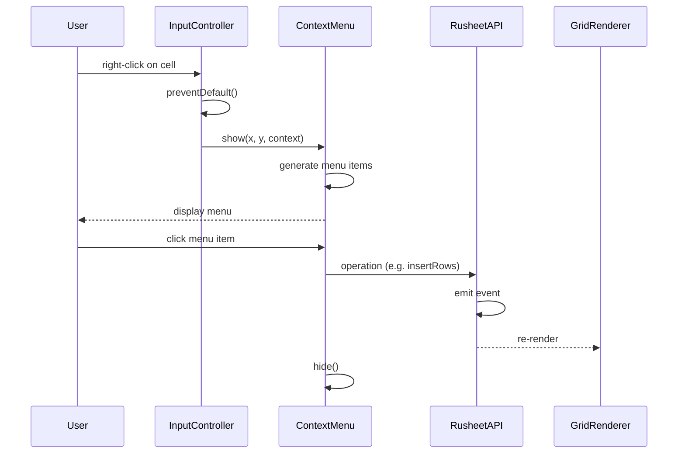

<spec>

# Context Menu Grid Operations Wiring

## Overview

Define how context menu items wire to existing RusheetAPI operations for insert/delete rows/cols, sort, filter, merge, conditional formatting, and data validation. Covers the action handler mapping from menu item click to API call, re-rendering after operations, and integration with both vanilla JS (main.ts) and React (RuSheet.tsx) entry points. All operations route through RusheetAPI to ensure event emission.

## Requirements

### R1 - Insert row/column operations

```yaml
id: R1
priority: high
status: draft
```

Insert row above: calls rusheet.insertRows(activeRow, 1). Insert row below: calls rusheet.insertRows(activeRow + 1, 1). Insert column left: calls rusheet.insertCols(activeCol, 1). Insert column right: calls rusheet.insertCols(activeCol + 1, 1). For range selections, insert count equals the number of selected rows/cols. After insert, re-render grid and update cell address display.

### R2 - Delete row/column operations

```yaml
id: R2
priority: high
status: draft
```

Delete row: calls rusheet.deleteRows(activeRow, count) where count is the number of selected rows (default 1). Delete column: calls rusheet.deleteCols(activeCol, count). After delete, re-render and update selection to the cell at the same position (or last row/col if deleted at end).

### R3 - Sort operations

```yaml
id: R3
priority: high
status: draft
```

Sort A→Z: calls rusheet.sortRange(startRow, endRow, startCol, endCol, sortCol, true). Sort Z→A: calls rusheet.sortRange(..., false). If a single column is selected, sort the entire data range by that column. If a range is selected, sort within the range by the leftmost column. After sort, re-render grid.

### R4 - Filter operation

```yaml
id: R4
priority: medium
status: draft
```

Create filter: toggles the filter dropdown for the active column, reusing the existing FilterDropdown component. If filters are already active on the column, the menu item label changes to 'Remove filter'. Calls rusheet.applyColumnFilter() or rusheet.clearColumnFilter() accordingly.

### R5 - Merge/unmerge cells

```yaml
id: R5
priority: medium
status: draft
```

If selection spans multiple cells and cells are not merged: menu shows 'Merge cells', calls rusheet.mergeCells(startRow, startCol, endRow, endCol). If cells are already merged: menu shows 'Unmerge cells', calls rusheet.unmergeCells(row, col). Single cell selection disables merge option.

### R6 - Entry point integration

```yaml
id: R6
priority: high
status: draft
```

In main.ts: instantiate ContextMenu after GridRenderer and InputController, pass renderer and rusheet references. Register contextmenu callback on InputController. In RuSheet.tsx: create ContextMenu in useEffect, wire to canvas ref and rusheet. Cleanup on unmount via contextMenu.destroy().

## Acceptance Criteria

### Scenario: Insert row above from context menu

- **GIVEN** Cell B3 is selected
- **WHEN** User right-clicks, selects 'Insert row above'
- **THEN** New empty row inserted at row 3, previous row 3 becomes row 4, grid re-renders

### Scenario: Delete column from column header

- **GIVEN** Column C header is right-clicked
- **WHEN** User selects 'Delete column'
- **THEN** Column C is removed, columns shift left, grid re-renders

### Scenario: Sort ascending from context menu

- **GIVEN** Range A1:D10 is selected, column B has numbers
- **WHEN** User right-clicks, selects 'Sort A→Z'
- **THEN** Range is sorted by column B ascending, grid re-renders with sorted data

### Scenario: Toggle filter from context menu

- **GIVEN** No filters active, cell C1 is selected
- **WHEN** User right-clicks, selects 'Create filter'
- **THEN** Filter dropdown appears for column C

### Scenario: Merge cells from context menu

- **GIVEN** Range B2:D4 is selected
- **WHEN** User right-clicks, selects 'Merge cells'
- **THEN** B2:D4 merged into single cell keeping B2 value, grid re-renders

### Scenario: Context menu in main.ts entry

- **GIVEN** App loaded via main.ts (vanilla JS)
- **WHEN** User right-clicks any cell
- **THEN** Context menu appears with all operations functional

### Scenario: Context menu in React entry

- **GIVEN** App loaded via RuSheet.tsx (React)
- **WHEN** User right-clicks any cell
- **THEN** Context menu appears with all operations functional, cleaned up on unmount

## Flow Diagram



</spec>
