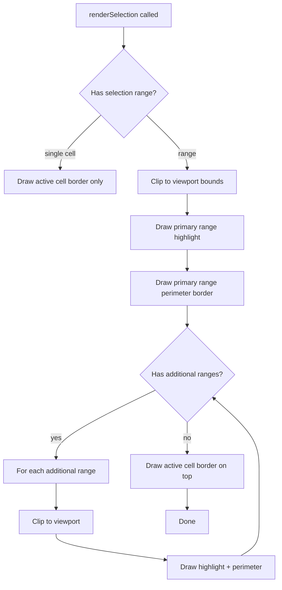

<spec>

# Selection Range Rendering

## Overview

Define how selection ranges are visually rendered on the grid canvas. Covers range highlight (semi-transparent background), active cell border, multi-selection rendering, and performance optimization for large ranges. All rendering uses Canvas 2D API and only draws cells within the visible viewport. Extends the existing renderSelection() method in GridRenderer.ts.

## Requirements

### R1 - Range highlight background

```yaml
id: R1
priority: high
status: draft
```

Selected range cells are rendered with a semi-transparent blue background (rgba(51, 133, 255, 0.12)) overlaid on the cell content. The highlight is drawn after cell content and before the selection border.

### R2 - Active cell border

```yaml
id: R2
priority: high
status: draft
```

The active cell (anchor) retains the existing solid blue border (2px, #3385FF). This is drawn on top of the range highlight.

### R3 - Range border

```yaml
id: R3
priority: high
status: draft
```

The entire selection range has a 1px solid blue border (#3385FF) drawn around its outer perimeter, not around each individual cell.

### R4 - Multi-selection rendering

```yaml
id: R4
priority: medium
status: draft
```

Each additional selection range is rendered with the same highlight + perimeter border style as the primary range. All ranges are visually distinct.

### R5 - Viewport-only rendering

```yaml
id: R5
priority: high
status: draft
```

Selection rendering only processes cells within the visible viewport. For a 100k-row selection, only the visible portion (~50 rows) is rendered. Uses viewport bounds from GridRenderer to clip.

### R6 - Selection state in GridRenderer

```yaml
id: R6
priority: high
status: draft
```

GridRenderer stores the full selection state (primary range + additional ranges + active cell) instead of just a single activeCell. A new setSelectionState() method replaces setActiveCell() for range-aware updates.

### R7 - No conflict with cell borders

```yaml
id: R7
priority: medium
status: draft
```

Selection highlight renders in a separate drawing pass that does not interfere with cell border rendering from grid-styling-spec. Z-order: cell background → cell borders → cell content → selection highlight → selection border → active cell border.

## Acceptance Criteria

### Scenario: Single cell selection renders as before

- **GIVEN** Single cell B2 is selected
- **WHEN** Grid renders
- **THEN** B2 has blue border (2px), no range highlight background

### Scenario: Range selection shows highlight and border

- **GIVEN** Range A1:C3 is selected with active cell A1
- **WHEN** Grid renders
- **THEN** A1:C3 cells have semi-transparent blue background, range has 1px perimeter border, A1 has 2px active cell border

### Scenario: Multi-selection renders all ranges

- **GIVEN** Primary A1:B2 and additional D4:E5 selected
- **WHEN** Grid renders
- **THEN** Both ranges show highlight + perimeter border independently

### Scenario: Large range only renders visible cells

- **GIVEN** Range A1:A100000 selected, viewport shows rows 50-100
- **WHEN** Grid renders
- **THEN** Only rows 50-100 column A get highlight, render time stays under 16ms

### Scenario: Selection does not cover cell borders

- **GIVEN** Cells have custom borders from grid-styling-spec
- **WHEN** Range selection is applied over those cells
- **THEN** Cell borders remain visible under the semi-transparent selection highlight

## Flow Diagram



</spec>
