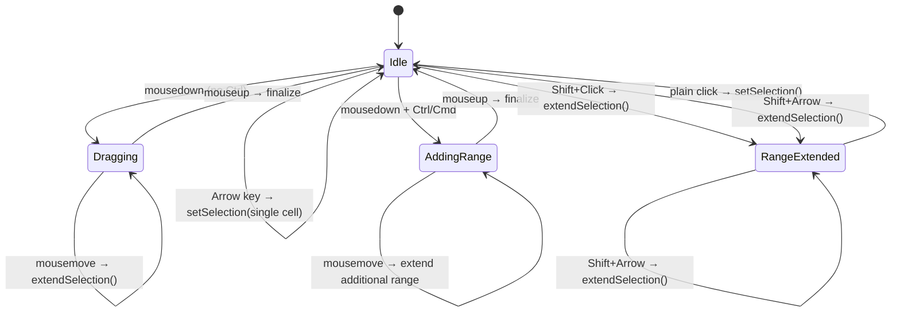

<spec>

# Selection UI Interaction

## Overview

Define mouse and keyboard interaction patterns for range selection in InputController.ts. Covers drag-to-select (mousedown/mousemove/mouseup state machine), Shift+Click range extension, Shift+Arrow keyboard extension, and Ctrl+Click multi-selection. All interactions route through the RusheetAPI selection methods defined in selection-wasm-api spec.

## Requirements

### R1 - Drag-to-select state machine

```yaml
id: R1
priority: high
status: draft
```

InputController tracks isDragging state. On mousedown: set anchor cell and start drag. On mousemove (while dragging): call extendSelection(row, col) for the cell under cursor. On mouseup: finalize selection and stop drag. Mousemove/mouseup listeners are added to document on mousedown and removed on mouseup to handle drag outside canvas.

### R2 - Shift+Click range extension

```yaml
id: R2
priority: high
status: draft
```

When user holds Shift and clicks a cell, extendSelection is called from the current active cell to the clicked cell, creating a rectangular range. Active cell (anchor) does not change.

### R3 - Shift+Arrow keyboard extension

```yaml
id: R3
priority: high
status: draft
```

When user holds Shift and presses arrow keys, extendSelection is called to extend the selection one cell in the arrow direction. Repeated Shift+Arrow continues extending. Without Shift, arrow keys reset to single cell selection.

### R4 - Ctrl+Click multi-selection

```yaml
id: R4
priority: high
status: draft
```

When user holds Ctrl (Cmd on macOS) and clicks a cell, addSelection is called to start a new disjoint range at the clicked cell. Subsequent Ctrl+drag extends that additional range.

### R5 - Click resets to single cell

```yaml
id: R5
priority: high
status: draft
```

A plain click (no modifier keys) on a cell resets the selection to a single cell at the clicked position, clearing any previous range or multi-selection.

### R6 - Listener cleanup

```yaml
id: R6
priority: medium
status: draft
```

Document-level mousemove and mouseup listeners added during drag are properly removed on mouseup and on component cleanup to prevent memory leaks.

## Acceptance Criteria

### Scenario: Drag to select range

- **GIVEN** Grid is loaded, no selection
- **WHEN** User mousedown on B2, drags to D5, mouseup
- **THEN** Selection range is B2:D5, active cell is B2

### Scenario: Shift+Click extends range

- **GIVEN** Active cell is A1
- **WHEN** User Shift+clicks on C3
- **THEN** Selection range is A1:C3, active cell remains A1

### Scenario: Shift+Arrow extends by one cell

- **GIVEN** Active cell is B2, single cell selected
- **WHEN** User presses Shift+Right then Shift+Down
- **THEN** Selection range is B2:C3

### Scenario: Ctrl+Click adds disjoint range

- **GIVEN** Selection is A1:B2
- **WHEN** User Ctrl+clicks on D4
- **THEN** Primary remains A1:B2, additional range D4:D4 is added

### Scenario: Plain click resets selection

- **GIVEN** Selection is A1:C5 with additional ranges
- **WHEN** User clicks on E1 (no modifiers)
- **THEN** Selection is single cell E1, all previous ranges cleared

### Scenario: Drag listener cleanup

- **GIVEN** User starts drag on A1
- **WHEN** User releases mouse outside canvas
- **THEN** Document mouseup fires, drag state is cleaned up, no lingering listeners

## Flow Diagram



</spec>
