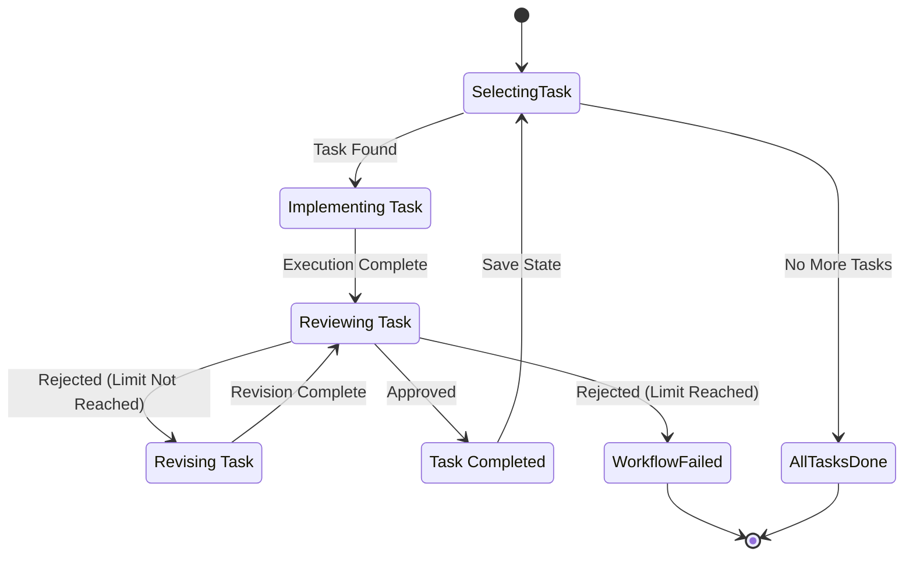

<spec>

# Per-Task Implementation Workflow

## Overview

This specification defines the refactoring of the implementation workflow to support a robust per-task iteration loop. It introduces precise state tracking via `current_task_id`, enforces a strict 2-revision limit per task, and utilizes `TaskGraph` for deterministic, dependency-aware task sequencing. The goal is to prevent infinite implementation loops and enable reliable resumption of interrupted workflows.

## Requirements

### R1 - Deterministic Task Sequencing

```yaml
id: R1
priority: high
status: draft
```

The workflow must identify the next task to execute by building a `TaskGraph` from `tasks.md`, performing a topological sort to respect dependencies, and using lexical sorting of task IDs as a tie-breaker for deterministic ordering.

### R2 - State Persistence & Resumption

```yaml
id: R2
priority: high
status: draft
```

The workflow must persist the ID of the task currently being executed in a new `current_task_id` field in `STATE.yaml`. If the workflow is restarted, it must resume execution from this task (or the next pending one if completed) rather than restarting from the beginning.

### R3 - Per-Task Review Loop

```yaml
id: R3
priority: high
status: draft
```

Each task must undergo an independent implementation-review-revision cycle. The review verdict applies only to the specific task being executed, generating a task-scoped review artifact (`REVIEW_IMPL_{task_id}.md`).

### R4 - Per-Task Revision Limits

```yaml
id: R4
priority: high
status: draft
```

The workflow must track the number of revisions for each task individually using a `task_revisions` map in `STATE.yaml`. A strict limit of 2 revisions (initial attempt + 2 revisions = 3 total runs) is enforced.

### R5 - Terminal Failure Behavior

```yaml
id: R5
priority: high
status: draft
```

If a task fails review after reaching the revision limit, the workflow must enter a terminal failure state. It must stop processing subsequent tasks, mark the current task as failed, and require manual operator intervention to resolve. It must NOT auto-approve or infinite-loop.

### R6 - Backward Compatibility

```yaml
id: R6
priority: medium
status: draft
```

The system must support loading legacy `STATE.yaml` files that lack `current_task_id` or `task_revisions` fields. These fields should default to `None` and empty map respectively, ensuring existing changes can continue without migration errors.

### R7 - Clean Working Directory Check

```yaml
id: R7
priority: medium
status: draft
```

For the `in_place` git workflow, the system must verify that the working directory is clean (no uncommitted changes) before starting the implementation loop to prevent data loss during task resets or checkouts.

## Acceptance Criteria

### Scenario: Happy Path Execution (S1) — covers R1, R2, R3

- **GIVEN** A change with 3 tasks (A, B, C) where A depends on nothing, B depends on A, and C depends on B. All tasks are implemented correctly on the first attempt.
- **WHEN** The implementation workflow is triggered.
- **THEN** The workflow executes A, reviews A (Pass), executes B, reviews B (Pass), executes C, reviews C (Pass), and completes the implementation phase. `current_task_id` updates sequentially.

### Scenario: Task Revision Path (S2) — covers R3, R4

- **GIVEN** A change with Task A. Task A fails the initial review but is fixed and passes the subsequent review.
- **WHEN** The workflow runs and the first implementation of Task A is flawed.
- **THEN** The workflow executes A, reviews A (Fail), increments A's revision count to 1, re-executes A (Revise), reviews A (Pass), and marks A as complete.

### Scenario: Terminal Failure Limit (S3) — covers R4, R5

- **GIVEN** Task A fails review initially, then fails the first revision, and fails the second revision.
- **WHEN** The workflow runs and Task A fails review 3 consecutive times.
- **THEN** The workflow halts execution. Task A is marked as failed. The process exits with an error indicating manual intervention is required. No further tasks are executed.

### Scenario: Resume Interrupted Workflow (S4) — covers R2

- **GIVEN** The workflow was interrupted (e.g., process killed) while executing Task B. `STATE.yaml` has `current_task_id: "B"`.
- **WHEN** The implementation workflow is re-triggered.
- **THEN** The workflow loads the state, identifies Task B as the current task, and resumes execution/review for Task B before proceeding to Task C. Task A is skipped as it is already complete.

### Scenario: Legacy State Migration (S5) — covers R6

- **GIVEN** An older `STATE.yaml` file exists without `current_task_id` or `task_revisions`.
- **WHEN** The workflow is started with a legacy state file.
- **THEN** The system loads the state successfully, defaulting `current_task_id` to None and `task_revisions` to empty. It proceeds to identify the first pending task from `TaskGraph` and begins execution, saving the new schema format on the next update.

### Scenario: Deterministic Tie-Breaking (S6) — covers R1

- **GIVEN** A change with 3 tasks (X, A, M) that have no dependencies between them (equal topological depth).
- **WHEN** The implementation workflow determines execution order.
- **THEN** Tasks are executed in lexical order: A, M, X. Repeated runs produce the same order.

### Scenario: Clean Working Directory Check (S7) — covers R7

- **GIVEN** The `in_place` git workflow is selected and the working directory has uncommitted changes.
- **WHEN** The implementation workflow is triggered.
- **THEN** The workflow refuses to start and returns an error indicating uncommitted changes must be resolved first.

## Diagrams

### Per-Task Implementation State Machine



### Implementation Logic Flow

```mermaid
flowchart TB
    Start((Start Implementation))
    LoadState[Load STATE.yaml]
    BuildGraph[Build TaskGraph (Topo + Lexical)]
    GetNext{Get Next Pending Task} 
    SetCurrent[Set current_task_id]
    CheckLimit{Check Revision Limit} 
    Execute[Execute Task (Implement/Revise)]
    Review{Review Task} 
    IncRevision[Increment Revision Count]
    Fail[Terminal Failure]
    MarkDone[Mark Task Completed]
    Success((Implementation Phase Complete))
    Start -->|| LoadState
    LoadState -->|| BuildGraph
    BuildGraph -->|| GetNext
    GetNext -->|No pending tasks| Success
    GetNext -->|Task found| SetCurrent
    SetCurrent -->|| CheckLimit
    CheckLimit -.->|Revisions > 2| Fail
    CheckLimit -->|Revisions <= 2| Execute
    Execute -->|Gen/Apply Code| Review
    Review -->|Approved| MarkDone
    Review -.->|Rejected| IncRevision
    IncRevision -->|| SetCurrent
    MarkDone -->|Update State| GetNext
```

## API Specification (Serverless Workflow 0.8)

```yaml
id: impl-workflow-loop
name: Per-Task Implementation Loop
specVersion: "0.8"
start: load-state
states:
- name: load-state
  transition: get-next-task
  type: operation
- dataConditions:
  - condition: ${ .has_pending_task }
    transition: check-limit
  defaultCondition:
    transition: success
  name: get-next-task
  type: switch
- dataConditions:
  - condition: ${ .revisions > 2 }
    transition: terminal-fail
  defaultCondition:
    transition: execute-task
  name: check-limit
  type: switch
- name: execute-task
  transition: review-task
  type: operation
- dataConditions:
  - condition: ${ .approved }
    transition: mark-complete
  defaultCondition:
    transition: increment-revision
  name: review-task
  type: switch
- name: increment-revision
  transition: check-limit
  type: operation
- name: mark-complete
  transition: get-next-task
  type: operation
- name: terminal-fail
  type: end
- name: success
  type: end
```

</spec>
