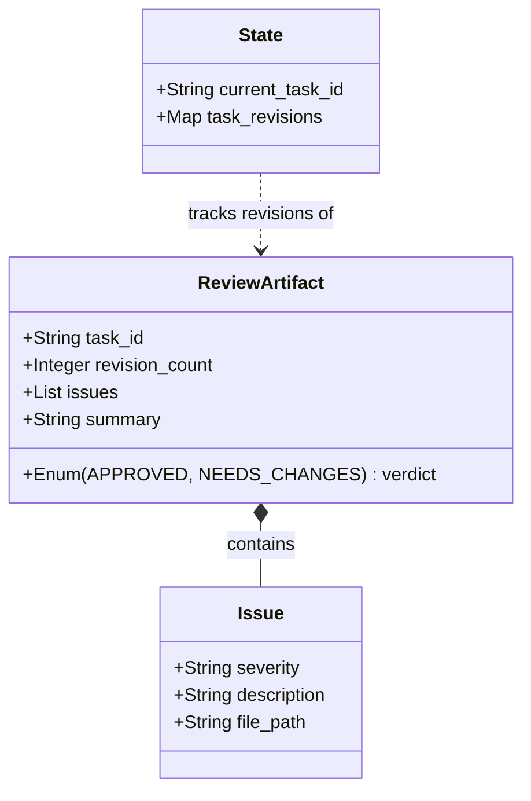
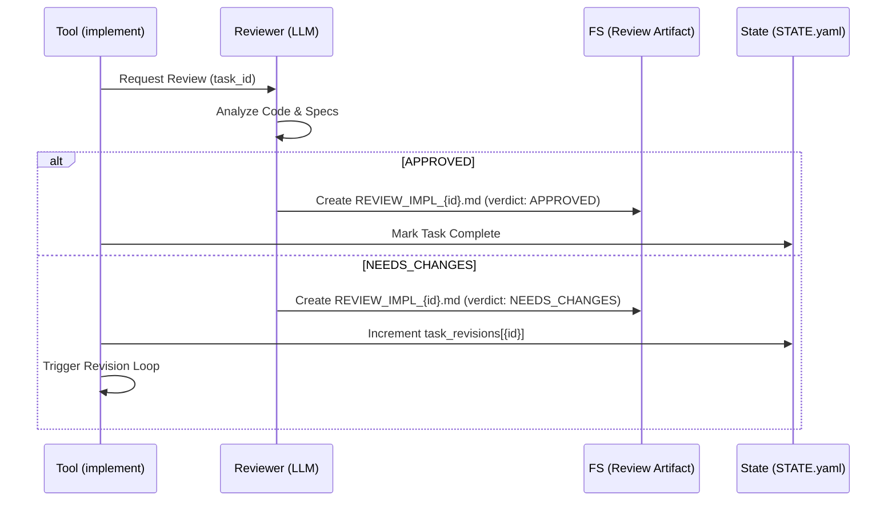

<spec>

# Task-Scoped Review Protocol

## Overview

Defines per-task review artifacts, verdict handling, and revision tracking in STATE.yaml. This protocol ensures that each task in the implementation workflow has an independent review lifecycle and artifact, preventing overwrite conflicts and enabling precise revision history tracking.

## Requirements

### R1 - Task-Scoped Artifact Naming

```yaml
id: R1
priority: medium
status: draft
```

Review artifacts must be named `REVIEW_IMPL_{task_id}.md` (e.g., `REVIEW_IMPL_1.1.md`) to uniquely identify reviews for each task. The file must be stored in the change directory.

### R2 - Artifact Structure & Metadata

```yaml
id: R2
priority: medium
status: draft
```

The review artifact must contain structured frontmatter including `task_id`, `verdict` (APPROVED | NEEDS_CHANGES), and `revision_count` to allow automated parsing and state logic integration.

### R3 - Verdict State Logic

```yaml
id: R3
priority: medium
status: draft
```

A verdict of `NEEDS_CHANGES` must trigger an increment of the revision count for the specific task in `STATE.yaml`. A verdict of `APPROVED` marks the task as complete without incrementing the revision count further.

### R4 - Revision Tracking State

```yaml
id: R4
priority: medium
status: draft
```

The `STATE.yaml` schema must include a `task_revisions` map (Map<String, Integer>) to persist the number of revisions performed for each task ID, enabling enforcement of revision limits.

### R5 - Tool Integration

```yaml
id: R5
priority: medium
status: draft
```

The `genesis_review_implementation` tool must be extended to accept an optional `task_id` parameter, which directs it to generate the task-scoped artifact instead of the global `REVIEW_IMPL.md`.

### R6 - Artifact Readability

```yaml
id: R6
priority: medium
status: draft
```

The `genesis_read_file` tool must accept `review_impl:{task_id}` (e.g., `review_impl:1.1`) to resolve the specific task review file. Direct file path access must remain supported as a fallback.

## Acceptance Criteria

### Scenario: First Review Generation (S1)

- **GIVEN** A pending task '1.1' is executed for the first time
- **WHEN** The review tool runs for task '1.1'
- **THEN** A file named `REVIEW_IMPL_1.1.md` is created with `revision_count: 0`

### Scenario: Revision Increment (S2)

- **GIVEN** Task '1.1' exists with `task_revisions: 0`
- **WHEN** The review returns `NEEDS_CHANGES`
- **THEN** `task_revisions` for '1.1' becomes 1 in STATE.yaml

### Scenario: Independent Artifacts (S3)

- **GIVEN** Task '1.1' and '1.2' are being reviewed sequentially
- **WHEN** Both tasks undergo review
- **THEN** `REVIEW_IMPL_1.1.md` and `REVIEW_IMPL_1.2.md` exist independently without overwriting each other

### Scenario: Reading Review Artifact (S4)

- **GIVEN** A specific task review file exists
- **WHEN** `genesis_read_file` is called with `file='review_impl:1.1'`
- **THEN** The content of `REVIEW_IMPL_1.1.md` is returned

### Scenario: Legacy State Compatibility (S5)

- **GIVEN** A legacy STATE.yaml file without `task_revisions`
- **WHEN** The state manager loads the file
- **THEN** The state loads successfully with an empty `task_revisions` map

### Scenario: Tool Integration - Scoped vs Global (S6)

- **GIVEN** An implementation exists
- **WHEN** `genesis_review_implementation` is called without `task_id`
- **THEN** It generates `REVIEW_IMPL.md` (legacy behavior)

### Scenario: Tool Integration - Task-Scoped Artifact (S7)

- **GIVEN** Task '1.1' has been implemented
- **WHEN** `genesis_review_implementation` is called with `task_id='1.1'`
- **THEN** A file named `REVIEW_IMPL_1.1.md` is created (not `REVIEW_IMPL.md`)

## Diagrams

### Review Artifact Data Model



### Task Review Sequence



</spec>
