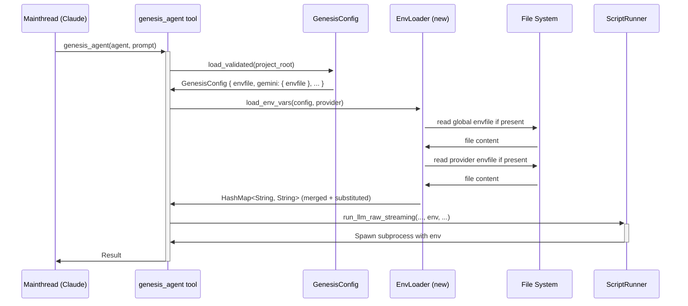

<spec>

# Envfile Support for Genesis Agents

## Overview

This spec defines the implementation of .env file support for Genesis agents. It allows users to specify environment files both globally and per-provider in config.toml. The system will load these files, perform variable substitution, and pass the resulting environment variables to the agent subprocesses.

## Requirements

### R1 - Global Envfile Support

```yaml
id: R1
priority: medium
status: draft
```

Support 'envfile' field in the [workflow] section of config.toml for global environment variables.

### R2 - Per-Provider Envfile Support

```yaml
id: R2
priority: medium
status: draft
```

Support 'envfile' field in [gemini], [codex], and [claude] sections for provider-specific overrides.

### R3 - Environment Override Logic

```yaml
id: R3
priority: medium
status: draft
```

Per-provider environment variables from envfiles must override global ones when there is a name collision.

### R4 - Variable Substitution

```yaml
id: R4
priority: medium
status: draft
```

Implement .env parsing with variable substitution (e.g., ${VAR}) following industry standards.

### R5 - Agent Integration

```yaml
id: R5
priority: medium
status: draft
```

The genesis_agent tool must load and apply configured envfiles before executing the agent CLI.

## Acceptance Criteria

### Scenario: Per-provider override

- **GIVEN** A global .env with KEY=global_val and a gemini.env with KEY=gemini_val.
- **WHEN** The Gemini agent is executed.
- **THEN** The Gemini agent should see KEY=gemini_val.

### Scenario: Variable substitution

- **GIVEN** An .env file with BASE_PATH=/tmp and LOG_FILE=${BASE_PATH}/app.log.
- **WHEN** The agent is executed.
- **THEN** The agent should see LOG_FILE=/tmp/app.log.

### Scenario: Global envfile loading

- **GIVEN** A global .env file exists and is configured in [workflow].
- **WHEN** Any agent is executed.
- **THEN** The agent should see the environment variables from the global .env file.

### Scenario: Missing envfile handling

- **GIVEN** An envfile path is specified in config.toml but the file does not exist.
- **WHEN** The agent is executed.
- **THEN** The system should log a warning but proceed with other available environment variables.

### Scenario: Invalid envfile format handling

- **GIVEN** An envfile contains an invalid line (e.g., missing =).
- **WHEN** The agent is executed.
- **THEN** The system should skip the invalid line and continue parsing the rest of the file.

## Diagrams

### Agent Execution with Envfile Support



</spec>
