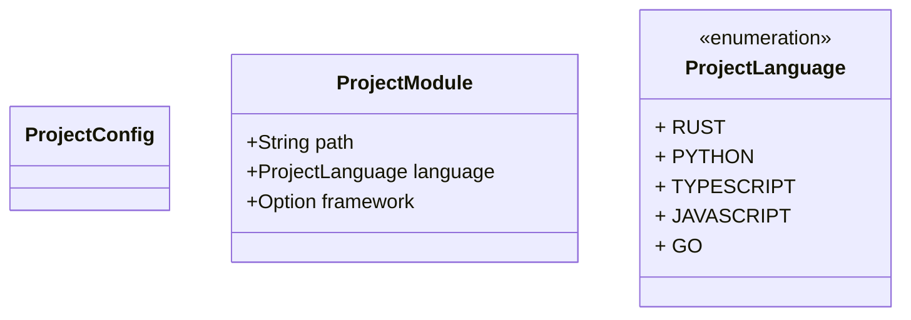

<spec>

# Project Configuration Data Model

## Overview

Defines the data model for the `[project]` section in the configuration file. This model supports monorepo structures by allowing explicit mapping of directory paths to programming languages and frameworks, replacing heuristic-based detection.

## Requirements

### R1 - Project Section Structure

```yaml
id: R1
priority: medium
status: draft
```

The configuration must support a top-level `[project]` section containing a list of modules.

### R2 - Module Definition

```yaml
id: R2
priority: medium
status: draft
```

Each module must define a `path` relative to the project root and a `language`.

### R3 - Language Enumeration

```yaml
id: R3
priority: medium
status: draft
```

The `language` field must be a strictly typed enumeration supporting at least Rust, Python, TypeScript, JavaScript, and Go.

### R4 - Optional Framework

```yaml
id: R4
priority: medium
status: draft
```

Modules may optionally specify a `framework` field to aid in tool selection and code generation.

### R5 - TOML Compatibility

```yaml
id: R5
priority: medium
status: draft
```

The structure must be serializable to and deserializable from TOML format.

## Acceptance Criteria

### Scenario: Monorepo Configuration

- **GIVEN** A monorepo with a Rust backend and React frontend
- **WHEN** The config file contains a `[project]` section with two modules defined
- **THEN** The configuration parses into two ProjectModule instances with correct languages and paths

### Scenario: Invalid Language

- **GIVEN** A configuration file with an unsupported language string
- **WHEN** The config is loaded
- **THEN** The deserialization fails with a validation error indicating the invalid enum value

### Scenario: Missing Path

- **GIVEN** A configuration module missing the required path field
- **WHEN** The config is loaded
- **THEN** The deserialization fails with a missing field error

### Scenario: Optional Framework Usage

- **GIVEN** A module definition with `framework = "axum"` and another without the framework field
- **WHEN** The configuration is parsed
- **THEN** The first module has `Some("axum")` and the second has `None`

### Scenario: TOML Round-trip

- **GIVEN** A valid `ProjectConfig` object in memory
- **WHEN** It is serialized to TOML and then deserialized back
- **THEN** The resulting object is identical to the original

## Diagrams

### Project Config Data Model



## API Specification (JSON Schema)

```yaml
properties:
  project:
    properties:
      modules:
        items:
          properties:
            framework:
              description: Optional framework name (e.g., axum, react, django)
              type: string
            language:
              enum:
              - rust
              - python
              - typescript
              - javascript
              - go
              type: string
            path:
              description: Relative path to the module root
              type: string
          required:
          - path
          - language
          type: object
        type: array
    required:
    - modules
    type: object
title: Project Configuration
type: object
```

</spec>
