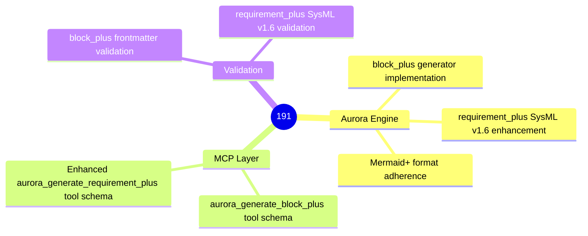
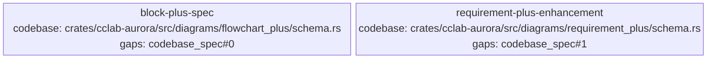

<proposal>

# Spec Navigation Map: 191

## Scope Overview (Mindmap)

## Spec Dependency Graph (Block Diagram)

## Spec Execution Order

1. **block-plus-spec** — Mermaid+ Block Diagram Specification
   - code: crates/cclab-aurora/src/diagrams/block_plus/, crates/cclab-aurora/src/diagrams/mod.rs
2. **requirement-plus-enhancement** — Enhanced Requirement+ Specification (SysML v1.6)
   - code: crates/cclab-aurora/src/diagrams/requirement_plus/, crates/cclab-aurora/src/mcp/tools.rs

</proposal>
