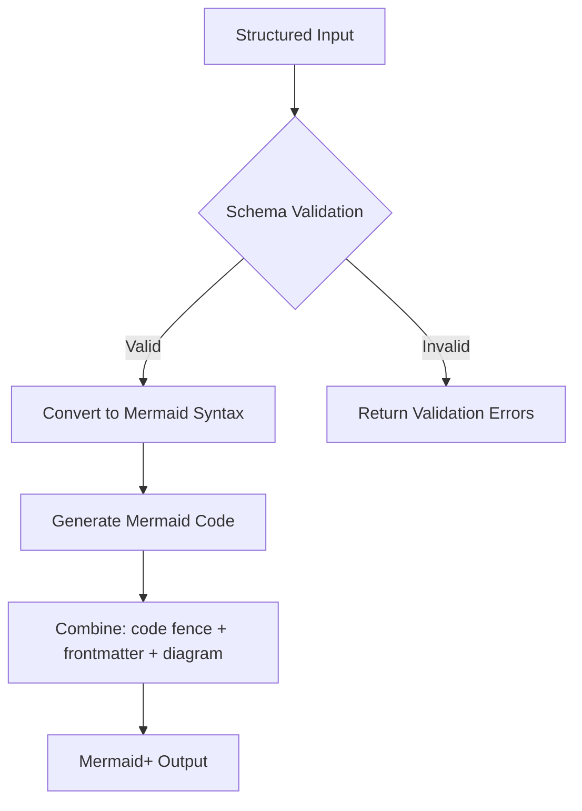

<spec>

# Mermaid+ Block Diagram Specification

## Overview

Specification for the Mermaid+ Block Diagram generator. This diagram type supports columns, nested blocks, edges, and shapes with YAML frontmatter validation.

## Requirements

### R1 - Mermaid Block Syntax Support

```yaml
id: R1
priority: medium
status: draft
```

Support Mermaid block-beta diagram syntax including 'columns' and 'block' definitions.

### R2 - Frontmatter Validation

```yaml
id: R2
priority: medium
status: draft
```

Support YAML frontmatter validation for block definitions, including nested blocks and connections.

### R3 - Mermaid+ Format Compliance

```yaml
id: R3
priority: medium
status: draft
```

Adhere to Mermaid+ format with frontmatter inside the code block.

## Acceptance Criteria

### Scenario: Valid Block Generation

- **GIVEN** A valid block definition with columns and nested blocks.
- **WHEN** Calling aurora_generate_block_plus.
- **THEN** Returns Mermaid+ output with correct block-beta syntax and frontmatter.

### Scenario: Missing ID Validation

- **GIVEN** A block definition missing required fields (e.g. id).
- **WHEN** Calling aurora_generate_block_plus.
- **THEN** Returns a validation error.

## Diagrams

### Block+ Processing Flow



</spec>
