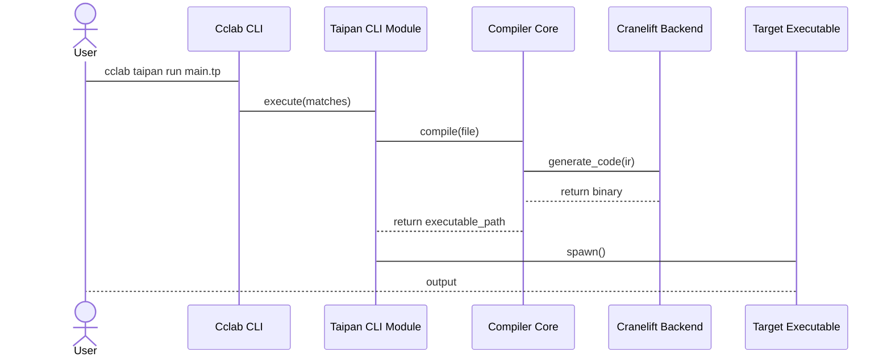

<spec>

# Taipan CLI Integration

## Overview

This specification covers the integration of the Taipan compiler into the unified Cclab CLI. It defines the 'taipan' subcommand, its registration via the modular CLI architecture, and the command flow for compilation and execution.

## Requirements

### R1 - CliModule Registration

```yaml
id: R1
priority: high
status: draft
```

Register the TaipanCli module with the unified CLI using the linkme-based distributed slice pattern.

### R2 - Taipan Compile Command

```yaml
id: R2
priority: high
status: draft
```

Provide a 'compile' subcommand to transform Taipan source files into native executables.

### R3 - Pluggable Backend Support

```yaml
id: R3
priority: medium
status: draft
```

Support a '--backend' argument to select the codegen backend, defaulting to 'cranelift'.

### R4 - Taipan Run Command

```yaml
id: R4
priority: high
status: draft
```

Provide a 'run' subcommand that compiles and executes Taipan source code in a single step.

## Acceptance Criteria

### Scenario: Successful CLI Registration

- **WHEN** The CLI is built and 'cclab' is executed.
- **THEN** The 'taipan' subcommand should be listed in 'cclab --help' and correctly dispatched.

### Scenario: Compile Source File with Default Backend

- **WHEN** 'cclab taipan compile hello.tp -o hello' is executed.
- **THEN** A native binary should be produced using the Cranelift backend.

### Scenario: Compile with Specific Backend

- **WHEN** 'cclab taipan compile hello.tp --backend cranelift' is executed.
- **THEN** The compiler should use the specified backend (e.g., cranelift) for code generation.

### Scenario: Compile and Run

- **WHEN** 'cclab taipan run hello.tp' is executed.
- **THEN** The program should be compiled, executed, and its output displayed to the user.

## Diagrams

### Taipan Run Sequence



</spec>
