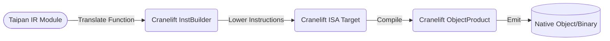

<spec>

# Taipan Cranelift Backend

## Overview

This specification defines the Cranelift backend for the Taipan compiler. It covers the mapping of Taipan IR to Cranelift-specific instructions and the process of emitting native machine code for the host platform.

## Requirements

### R1 - Type Mapping

```yaml
id: R1
priority: high
status: draft
```

Map Taipan primitive types (int, float) to Cranelift native types (I64, F64).

### R2 - Instruction Translation

```yaml
id: R2
priority: high
status: draft
```

Translate Taipan IR instructions (Add, Sub, etc.) into their Cranelift equivalents using the InstBuilder API.

### R3 - Native ABI Management

```yaml
id: R3
priority: high
status: draft
```

Manage function signatures and calling conventions to ensure compatibility with native host execution.

### R4 - Object File Emission

```yaml
id: R4
priority: high
status: draft
```

Leverage the cranelift-object crate to produce standard object files (ELF/Mach-O/COFF) for the host architecture.

### R5 - External Function Support

```yaml
id: R5
priority: high
status: draft
```

Implement support for calling external native functions (e.g., print) from compiled Taipan code.

## Acceptance Criteria

### Scenario: Translate Arithmetic Instruction

- **WHEN** A Taipan IR 'Add' instruction is encountered.
- **THEN** The backend should call 'ins().iadd(a, b)' on the Cranelift builder.

### Scenario: Function Return Lowering

- **WHEN** A Taipan IR 'Return' instruction is encountered.
- **THEN** The backend should emit a 'return' instruction with the result value in the correct register.

### Scenario: Produce ELF/Mach-O Binary

- **WHEN** Final compilation phase is triggered.
- **THEN** The backend should output a valid object file that can be linked or executed.

## Diagrams

### Cranelift Backend Pipeline



</spec>
