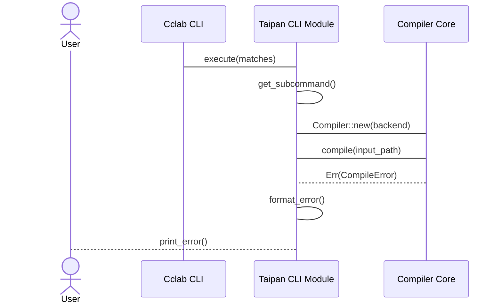

<spec>

# Taipan CLI Module Implementation

## Overview

This specification defines the implementation details for the Taipan CLI module. It covers the mapping of CLI arguments to compiler core functions and the handling of compilation results and errors for the user interface.

## Requirements

### R1 - CliModule Trait Implementation

```yaml
id: R1
priority: high
status: draft
```

Implement the CliModule trait for the TaipanCli struct to enable auto-registration.

### R2 - Subcommand Definition

```yaml
id: R2
priority: high
status: draft
```

Use clap to define the 'compile' and 'run' subcommands with their respective arguments.

### R3 - Argument Mapping

```yaml
id: R3
priority: high
status: draft
```

Map CLI matches to Compiler configuration and invocation logic.

### R4 - Error Formatting and Output

```yaml
id: R4
priority: high
status: draft
```

Capture and format compiler errors (syntax, semantic, backend) into user-friendly CLI messages.

### R5 - I/O Management

```yaml
id: R5
priority: medium
status: draft
```

Support file system operations for reading source code and writing generated binaries.

## Acceptance Criteria

### Scenario: Execute Compile Command

- **WHEN** 'cclab taipan compile main.tp' is executed.
- **THEN** The compiler should be invoked with the correct input path and backend settings.

### Scenario: Handle Compilation Error

- **WHEN** The compiler returns an error during parsing.
- **THEN** The CLI should print a formatted error message and exit with a non-zero code.

### Scenario: Execute Run Command

- **WHEN** 'cclab taipan run main.tp' is executed.
- **THEN** The CLI should compile the code and immediately spawn the resulting process.

## Diagrams

### Taipan CLI Execution Flow



</spec>
