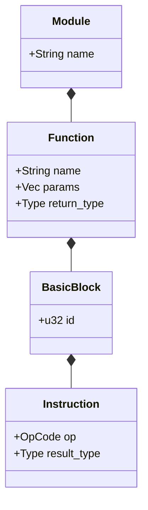
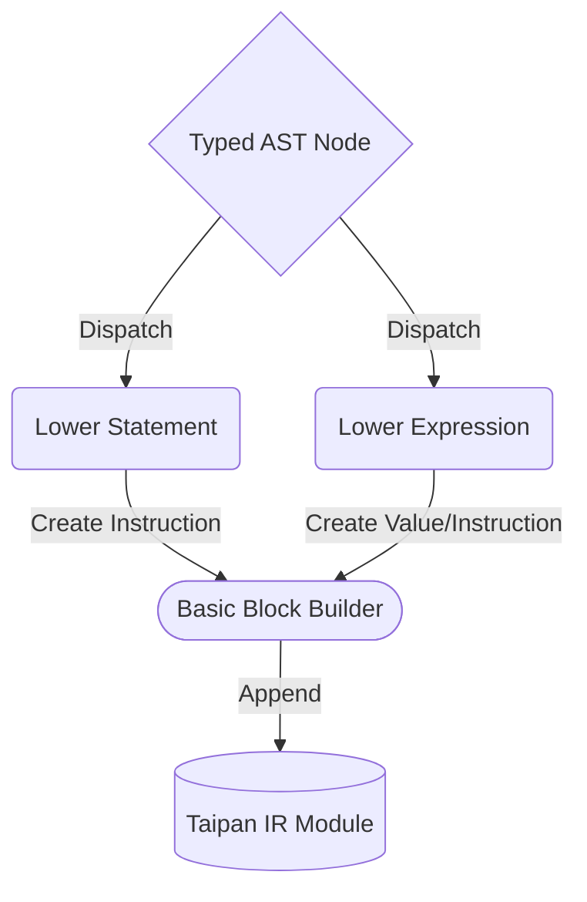

<spec>

# Taipan Intermediate Representation (IR)

## Overview

This specification defines the Intermediate Representation (IR) used by the Taipan compiler. The IR is structured in Static Single Assignment (SSA) form and acts as the bridge between the high-level Typed AST and the low-level machine code backends.

## Requirements

### R1 - IR Hierarchy Structure

```yaml
id: R1
priority: high
status: draft
```

Define the IR hierarchy: Module contains Functions, which contain BasicBlocks, which contain Instructions.

### R2 - Static Single Assignment (SSA)

```yaml
id: R2
priority: high
status: draft
```

Every instruction that produces a value must assign it to a unique, immutable virtual register (SSA).

### R3 - Instruction Set Architecture (ISA) Core

```yaml
id: R3
priority: high
status: draft
```

Support essential opcodes: Add, Sub, Mul, Div, LoadConst, Call, Return.

### R4 - Typed IR Representation

```yaml
id: R4
priority: high
status: draft
```

Each instruction and value in the IR must be explicitly typed (Int, Float).

### R5 - Lowering Algorithm

```yaml
id: R5
priority: high
status: draft
```

Provide a transformation algorithm to convert the Typed AST into the Taipan IR.

## Acceptance Criteria

### Scenario: Lower Simple Addition

- **WHEN** Lowering the expression '1 + 2'
- **THEN** The IR should contain a LoadConst for '1', a LoadConst for '2', and an Add instruction using their results.

### Scenario: Lower Function Call

- **WHEN** Lowering the expression 'print(x)'
- **THEN** The IR should contain a Call instruction with the target function name and argument values.

### Scenario: Maintain SSA Invariants

- **WHEN** Lowering complex nested expressions.
- **THEN** Each virtual register should be defined exactly once.

## Diagrams

### Taipan IR Class Diagram



### Lowering Process (TypedAST -> IR)



</spec>
