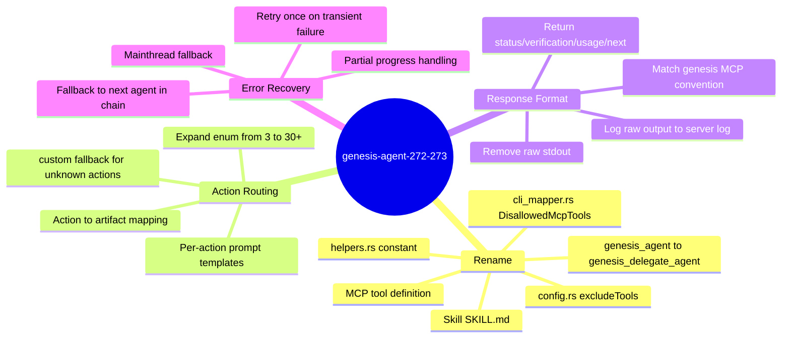
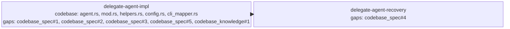

<proposal>

# Spec Navigation Map: genesis-agent-272-273

## Scope Overview (Mindmap)

## Spec Dependency Graph (Block Diagram)

## Spec Execution Order

1. **delegate-agent-impl** — Implement delegate-agent spec: rename, action routing, artifact response
   - code: crates/cclab-genesis/src/mcp/tools/agent.rs, crates/cclab-genesis/src/mcp/tools/mod.rs, crates/cclab-genesis/src/mcp/tools/run_change/helpers.rs, crates/cclab-genesis/src/mcp/config.rs, crates/cclab-genesis/src/orchestrator/cli_mapper.rs, .claude/skills/cclab-genesis-agent/SKILL.md
2. **delegate-agent-recovery** — Error recovery: retry + fallback chain for delegate-agent
   - depends: delegate-agent-impl
   - code: crates/cclab-genesis/src/mcp/tools/agent.rs

</proposal>
