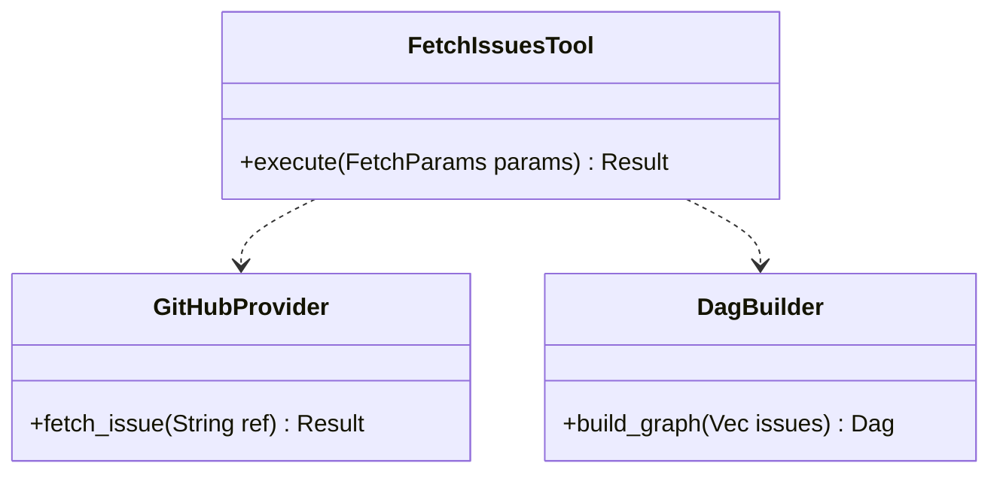

<spec>

# GitHub Issue Fetching and Dependency Extraction

## Overview

This specification defines the genesis_fetch_issues MCP tool, which automates the retrieval of GitHub issue content and the construction of a dependency-aware topological graph. The tool uses the gh CLI for authentication and data retrieval, parses issue descriptions for dependency links, and updates the STATE.yaml file with a new dag section to govern the workflow iteration order.

## Requirements

### R1 - MCP Tool Interface

```yaml
id: R1
priority: medium
status: draft
```

Expose genesis_fetch_issues tool via OpenRPC interface.

### R2 - GitHub CLI Integration

```yaml
id: R2
priority: medium
status: draft
```

Use gh CLI (gh issue view) to retrieve issue body, labels, and metadata.

### R3 - Dependency Extraction

```yaml
id: R3
priority: medium
status: draft
```

Extract issue dependencies from descriptions (e.g., blockedBy, #NNN) and build a directed acyclic graph.

### R4 - STATE.yaml DAG Update

```yaml
id: R4
priority: medium
status: draft
```

Update STATE.yaml with a dag section containing the topological sort of fetched issues.

### R5 - Context Awareness

```yaml
id: R5
priority: medium
status: draft
```

Support X-Genesis-Cwd header to execute gh commands in the correct repository context.

## Acceptance Criteria

### Scenario: Fetch single issue

- **GIVEN** Authentication via gh CLI is valid
- **WHEN** Tool is called with a single issue URL and no dependencies are found.
- **THEN** Issue content is stored in issue_{NNN}.md and STATE.yaml is updated with a single-node DAG.

### Scenario: Fetch with dependencies

- **WHEN** Issue A is fetched and its description contains 'blockedBy #B'.
- **THEN** All referenced issues are fetched and STATE.yaml contains a topological sort starting with the blocker.

### Scenario: Multi-project execution

- **WHEN** Tool is called with a project-specific CWD header.
- **THEN** The gh CLI command is executed within the directory specified by X-Genesis-Cwd.

## Diagrams

### Fetch Issues Class Structure



## API Specification (OpenRPC 1.3)

```yaml
info:
  title: Genesis Fetch Issues API
  version: 1.0.0
methods:
- name: genesis_fetch_issues
  params:
  - name: change_id
    schema:
      type: string
  - name: issue_refs
    schema:
      items:
        type: string
      type: array
  result:
    name: FetchResult
    schema:
      properties:
        issues:
          items:
            type: string
          type: array
        status:
          type: string
      type: object
  summary: Fetches GitHub issues and builds dependency graph in STATE.yaml
openrpc: 1.3.2
```

</spec>
