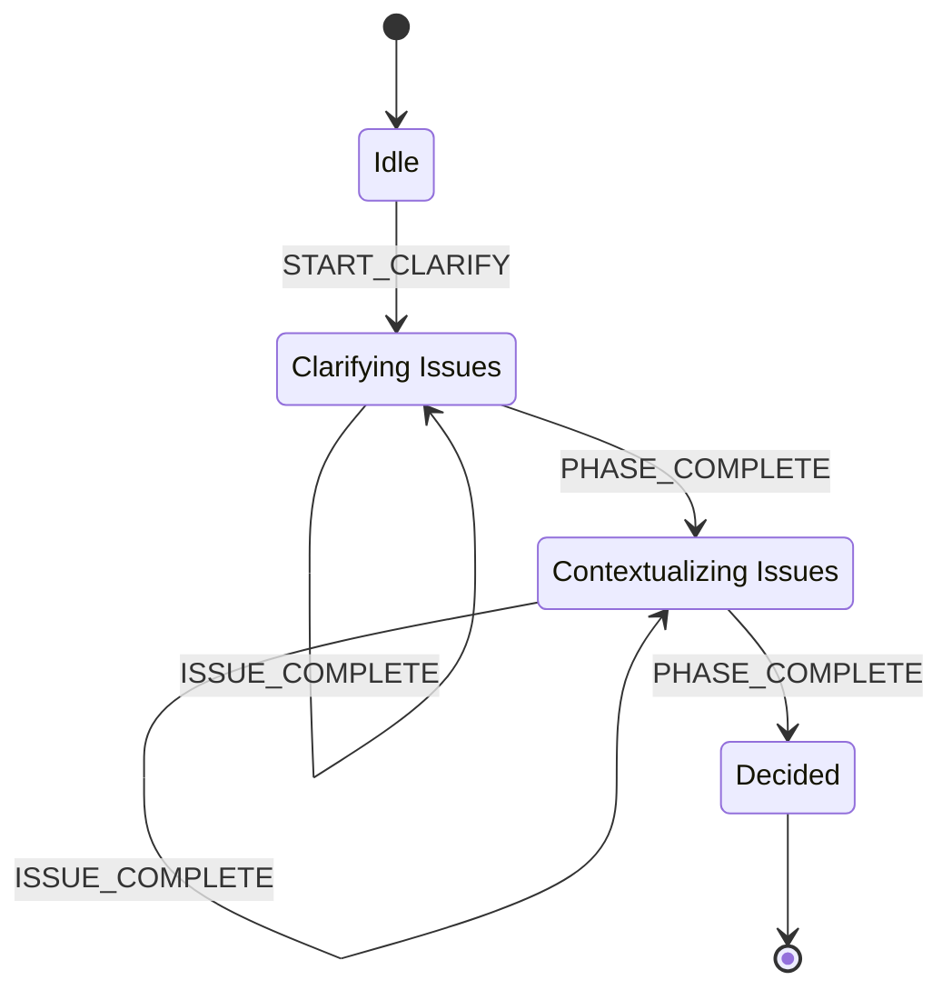

<spec>

# DAG-Based Topological Loop for run_change

## Overview

This specification governs the workflow orchestration for multi-issue changes. It extends the run_change logic to support topological looping based on the DAG defined in STATE.yaml. The workflow ensures that each issue is clarified and contextualized in the correct order, maintaining state via indices to support resumable execution across multiple tool calls.

## Requirements

### R1 - Topological Order Resolution

```yaml
id: R1
priority: medium
status: draft
```

Resolve the list of issues from STATE.yaml.dag.issues in their defined topological order.

### R2 - State Persistence

```yaml
id: R2
priority: medium
status: draft
```

Maintain and update clarify_index and context_index within the STATE.yaml dag section to track progress.

### R3 - Action Dispatching

```yaml
id: R3
priority: medium
status: draft
```

Dispatch action responses using the next field, targeting specific issues (e.g., next: clarify, change_id: X, issue_id: Y).

### R4 - Phase Transition Logic

```yaml
id: R4
priority: medium
status: draft
```

Automatically transition to the next phase (clarify -> context -> decided) once all issues in the DAG have been processed for the current phase.

## Acceptance Criteria

### Scenario: Iterative Clarification

- **GIVEN** STATE.yaml contains a DAG with 2 issues: A and B.
- **WHEN** run_change is called in clarify phase.
- **THEN** run_change returns action 'next: clarify' for issue A. Once A is clarified, run_change returns action 'next: clarify' for issue B.

### Scenario: Phase Completion

- **GIVEN** STATE.yaml dag.clarify_index is at the last issue.
- **WHEN** The final issue in the clarify loop is approved.
- **THEN** run_change updates phase to context_context_created and returns action 'next: context' for the first issue in the DAG.

### Scenario: Legacy Fallback

- **GIVEN** STATE.yaml has no dag section.
- **WHEN** run_change is called for a simple change without issue references.
- **THEN** run_change falls back to the standard single-issue workflow.

## Diagrams

### Topological Loop Algorithm

```mermaid
flowchart TB
    Start(Enter loop phase (clarify/context))
    ReadDag[Read dag section from STATE.yaml]
    IsIssueAvailable{Next issue in topological order?} 
    DispatchAction[Dispatch next: clarify/context]
    WaitCompletion[Wait for artifact approval]
    IncrementIndex[Increment dag.index in STATE.yaml]
    TransitionNextPhase[All issues processed for phase]
    End(Transition to Plan/Proposal)
    Start --> ReadDag
    ReadDag --> IsIssueAvailable
    IsIssueAvailable -->|Yes| DispatchAction
    DispatchAction --> WaitCompletion
    WaitCompletion -->|Complete| IncrementIndex
    IncrementIndex --> IsIssueAvailable
    IsIssueAvailable -->|No| TransitionNextPhase
    TransitionNextPhase --> End
```

### Run Change Loop State Machine



## API Specification (Serverless Workflow 0.8)

```yaml
id: run-change-dag-loop
name: Run Change DAG Loop
specVersion: '0.8'
start: Idle
states:
- name: Idle
  type: operation
- name: Clarifying
  type: operation
- name: Contextualizing
  type: operation
- name: Decided
  type: operation
version: 1.0.0
```

</spec>
