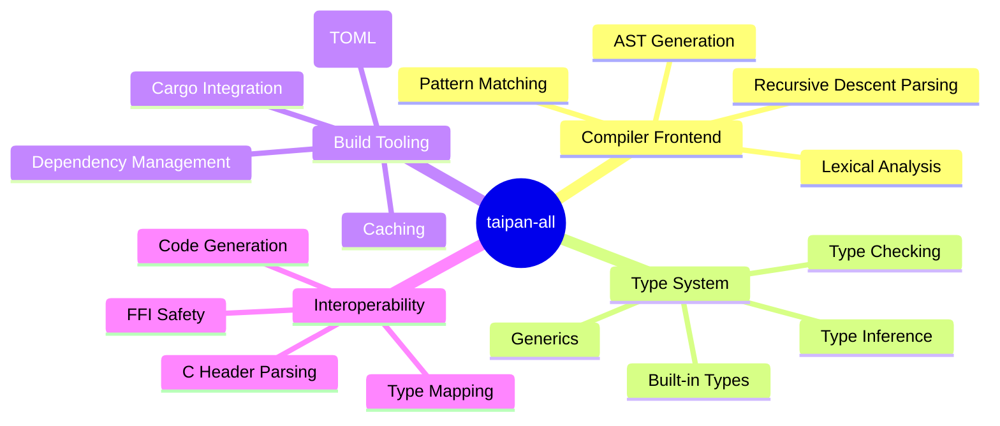
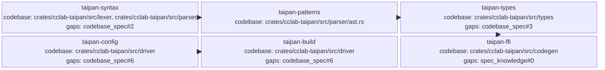

<proposal>

# Spec Navigation Map: taipan-all

## Scope Overview (Mindmap)

## Spec Dependency Graph (Block Diagram)

## Spec Execution Order

1. **taipan-config** — Compiler Configuration
   - code: crates/cclab-taipan/src/config, crates/cclab-taipan/src/driver
2. **taipan-build** — Build System Integration
   - depends: taipan-config
   - code: crates/cclab-taipan/src/build, crates/cclab-taipan/src/driver
3. **taipan-syntax** — Taipan Lexer and Parser v1
   - code: crates/cclab-taipan/src/lexer, crates/cclab-taipan/src/parser, crates/cclab-taipan/src/source
4. **taipan-patterns** — Pattern Matching Support
   - depends: taipan-syntax
   - code: crates/cclab-taipan/src/parser, crates/cclab-taipan/src/hir
5. **taipan-types** — Type System and Inference
   - depends: taipan-patterns
   - code: crates/cclab-taipan/src/types, crates/cclab-taipan/src/resolve
6. **taipan-ffi** — FFI and C Interoperability
   - depends: taipan-types
   - code: crates/cclab-taipan/src/ffi, crates/cclab-taipan/src/codegen

</proposal>
