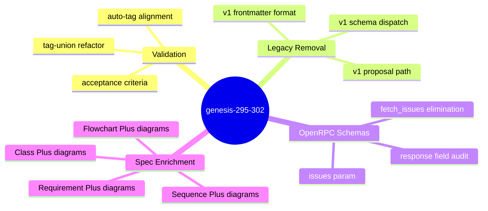
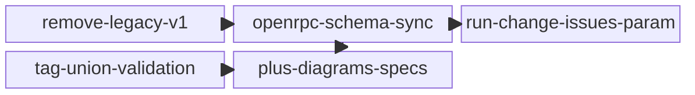

<proposal>

# Spec Navigation Map: genesis-295-302

## Scope Overview (Mindmap)

## Spec Dependency Graph (Block Diagram)

## Spec Execution Order

1. **remove-legacy-v1** — Remove legacy v1 proposal and schema paths
   - code: crates/cclab-genesis/src/services/proposal_service.rs, crates/cclab-genesis/src/mcp/tools/run_change/helpers.rs
2. **openrpc-schema-sync** — Sync OpenRPC response schemas with actual code return fields
   - depends: remove-legacy-v1
   - code: crates/cclab-genesis/src/mcp/tools/run_change/mod.rs, crates/cclab-genesis/src/mcp/tools/run_change/helpers.rs
3. **run-change-issues-param** — Add issues param to run_change, eliminate fetch_issues action
   - depends: openrpc-schema-sync
   - code: crates/cclab-genesis/src/mcp/tools/run_change/mod.rs, crates/cclab-genesis/src/mcp/tools/fetch_issues.rs
4. **tag-union-validation** — Refactor spec validation to compositional tag-union logic
   - code: crates/cclab-genesis/src/services/spec_service.rs, crates/cclab-genesis/src/models/spec_rules.rs
5. **plus-diagrams-specs** — Add Class+, Sequence+, Flowchart+, Requirement+ diagrams to genesis specs
   - depends: tag-union-validation, openrpc-schema-sync
   - code: cclab/specs/cclab-genesis/create-proposal.md, cclab/specs/cclab-genesis/create-spec.md, cclab/specs/cclab-genesis/run-change/README.md, cclab/specs/cclab-genesis/implement-change.md

</proposal>
