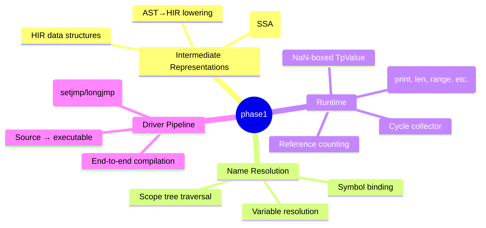
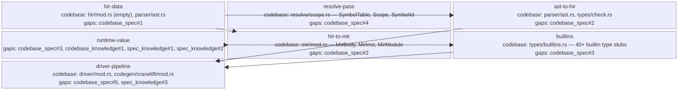

<proposal>

# Spec Navigation Map: phase1

## Scope Overview (Mindmap)

## Spec Dependency Graph (Block Diagram)

## Spec Execution Order

1. **hir-data** — HIR Data Structures
   - code: crates/cclab-taipan/src/hir/mod.rs, crates/cclab-taipan/src/hir/expr.rs, crates/cclab-taipan/src/hir/stmt.rs
2. **resolve-pass** — Name Resolution Pass
   - code: crates/cclab-taipan/src/resolve/pass.rs, crates/cclab-taipan/src/resolve/mod.rs
3. **ast-to-hir** — AST to HIR Lowering
   - depends: hir-data, resolve-pass
   - code: crates/cclab-taipan/src/lower/mod.rs, crates/cclab-taipan/src/lower/ast_to_hir.rs
4. **runtime-value** — Runtime Object Model (NaN-boxing) and Refcounting
   - code: crates/cclab-taipan/src/runtime/mod.rs, crates/cclab-taipan/src/runtime/value.rs, crates/cclab-taipan/src/runtime/rc.rs
5. **builtins** — Built-in Function Implementations
   - depends: runtime-value
   - code: crates/cclab-taipan/src/runtime/builtins.rs
6. **hir-to-mir** — HIR to MIR Lowering (SSA)
   - depends: hir-data, runtime-value
   - code: crates/cclab-taipan/src/lower/hir_to_mir.rs
7. **driver-pipeline** — End-to-End Driver CLI
   - depends: ast-to-hir, hir-to-mir, builtins
   - code: crates/cclab-taipan/src/driver/mod.rs, crates/cclab-taipan/src/lib.rs

</proposal>
