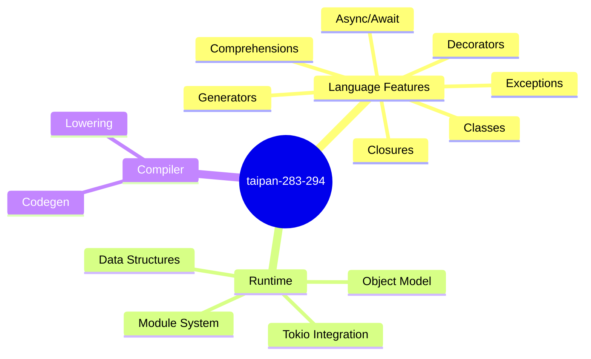
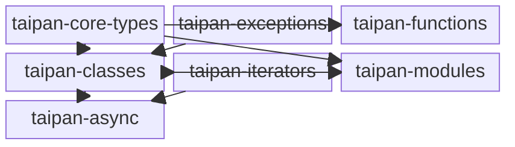

<proposal>

# Spec Navigation Map: taipan-283-294

## Scope Overview (Mindmap)

## Spec Dependency Graph (Block Diagram)

## Spec Execution Order

1. **taipan-core-types** — Core Data Structures (String, List, Dict, Tuple)
   - code: crates/cclab-taipan/src/runtime/objects/, crates/cclab-taipan/src/codegen/
2. **taipan-exceptions** — Exception Handling System
   - code: crates/cclab-taipan/src/runtime/exception.rs, crates/cclab-taipan/src/codegen/
3. **taipan-classes** — Classes, Inheritance, and Operator Overloading
   - depends: taipan-core-types, taipan-exceptions
   - code: crates/cclab-taipan/src/runtime/class.rs, crates/cclab-taipan/src/codegen/
4. **taipan-functions** — Closures and Decorators
   - depends: taipan-core-types
   - code: crates/cclab-taipan/src/runtime/function.rs, crates/cclab-taipan/src/lowering/
5. **taipan-iterators** — Iterators, Generators, and Comprehensions
   - depends: taipan-classes
   - code: crates/cclab-taipan/src/runtime/iter.rs, crates/cclab-taipan/src/codegen/
6. **taipan-async** — Async/Await with Tokio
   - depends: taipan-classes, taipan-iterators
   - code: crates/cclab-taipan/src/runtime/async.rs, crates/cclab-taipan/src/codegen/
7. **taipan-modules** — Module Import System
   - depends: taipan-core-types, taipan-classes
   - code: crates/cclab-taipan/src/runtime/module.rs, crates/cclab-taipan/src/codegen/

</proposal>
