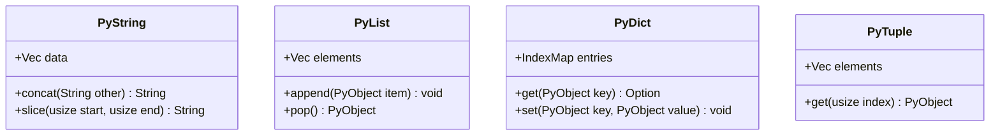

<spec>

# Core Data Structures (String, List, Dict, Tuple)

## Overview

Implementation of Python's core built-in types: String, List, Dict, and Tuple. These types must match CPython's behavior, including method availability, mutability characteristics, and performance characteristics (e.g. O(1) dict lookups).

## Requirements

### R1 - String Implementation

```yaml
id: R1
priority: medium
status: draft
```

Implement string type supporting unicode, immutability, and standard operations (concatenation, slicing, indexing).

### R2 - List Implementation

```yaml
id: R2
priority: medium
status: draft
```

Implement list type supporting dynamic resizing, mutability, and standard operations (append, pop, insert, extend).

### R3 - Dict Implementation

```yaml
id: R3
priority: medium
status: draft
```

Implement dictionary type supporting key-value mapping, insertion order preservation, and standard operations.

### R4 - Tuple Implementation

```yaml
id: R4
priority: medium
status: draft
```

Implement tuple type supporting immutable sequences and hashing (if elements are hashable).

## Acceptance Criteria

### Scenario: String Concatenation

- **GIVEN** Two strings 'hello' and 'world'
- **WHEN** They are concatenated
- **THEN** Result should be 'helloworld'

### Scenario: List Append

- **GIVEN** An empty list
- **WHEN** Value 1 is appended
- **THEN** List should contain [1]

### Scenario: Dict Set/Get

- **GIVEN** An empty dict
- **WHEN** 'key' is set to 'value'
- **THEN** Retrieving 'key' should return 'value'

### Scenario: Tuple Immutability

- **GIVEN** A tuple (1, 2)
- **WHEN** Element 0 is assigned a new value
- **THEN** A TypeError should be raised

## Diagrams

### Core Types Class Diagram



## API Specification (JSON Schema)

```yaml
definitions:
  PyDict:
    properties:
      entries:
        additionalProperties: {}
        type: object
    type: object
  PyList:
    properties:
      elements:
        items: {}
        type: array
    type: object
  PyString:
    properties:
      value:
        type: string
    type: object
  PyTuple:
    properties:
      elements:
        items: {}
        type: array
    type: object
```

</spec>
